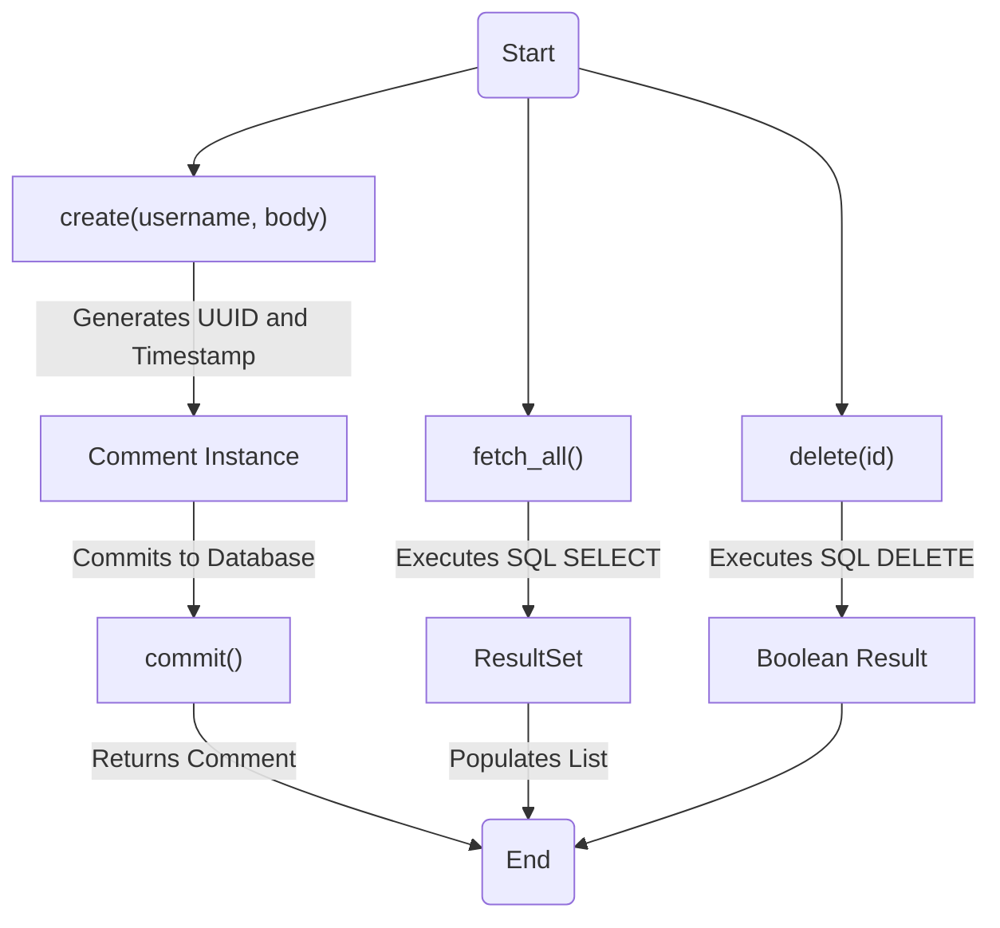
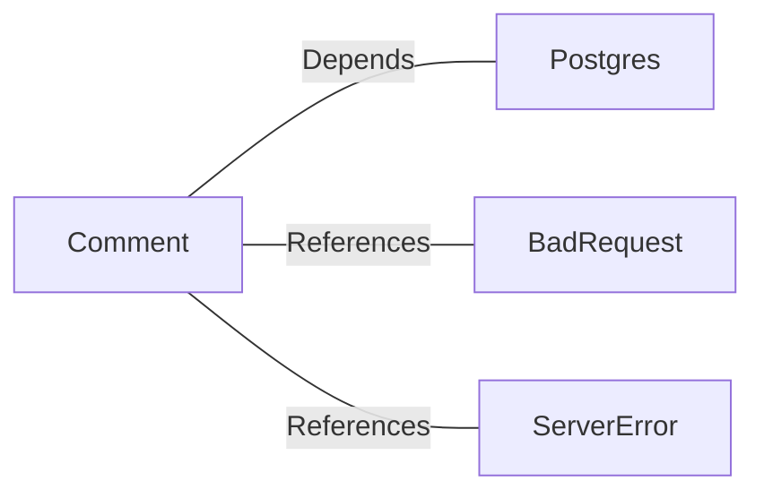

# Comment.java: Comment Management Class

## Overview
The `Comment` class is responsible for managing comments in an application. It provides functionality to create, fetch, and delete comments, as well as commit them to a database. The class interacts with a PostgreSQL database to store and retrieve comment data.

## Process Flow

## Insights
- **Comment Creation**: Generates a unique ID using `UUID.randomUUID()` and a timestamp using `Date().getTime()`. The comment is then committed to the database.
- **Fetching Comments**: Retrieves all comments from the database using a SQL `SELECT` query and populates a list of `Comment` objects.
- **Deleting Comments**: Deletes a comment by its ID using a SQL `DELETE` query.
- **Database Interaction**: The class heavily relies on the `Postgres.connection()` method to establish database connections.
- **Error Handling**: Exceptions are caught and either logged or rethrown as custom exceptions (`BadRequest`, `ServerError`).

## Dependencies

- `Postgres`: Provides the `connection()` method to interact with the PostgreSQL database.
- `BadRequest`: Custom exception thrown when a comment cannot be saved.
- `ServerError`: Custom exception thrown for server-related errors.

## Data Manipulation (SQL)
### Table Structure: `comments`
| Attribute   | Data Type   | Description                          |
|-------------|-------------|--------------------------------------|
| `id`        | `VARCHAR`   | Unique identifier for the comment.  |
| `username`  | `VARCHAR`   | Username of the comment author.     |
| `body`      | `TEXT`      | Content of the comment.             |
| `created_on`| `TIMESTAMP` | Timestamp when the comment was created. |

### SQL Operations
- **INSERT**: Adds a new comment to the `comments` table.
- **SELECT**: Retrieves all comments from the `comments` table.
- **DELETE**: Removes a comment from the `comments` table by its ID.

## Vulnerabilities
1. **SQL Injection**:
   - The `fetch_all()` method uses raw SQL queries (`stmt.executeQuery(query)`), which are vulnerable to SQL injection attacks. Prepared statements should be used instead.
   
2. **Improper Error Handling**:
   - The `delete()` method always returns `false` in the `finally` block, even if the operation succeeds. This can lead to incorrect behavior.
   - Exceptions are printed to `stderr` but not properly logged or handled in some methods.

3. **Resource Management**:
   - Database connections (`Connection cxn`) and statements (`Statement stmt`) are not properly closed in the `fetch_all()` method, which can lead to resource leaks.

4. **Hardcoded SQL Queries**:
   - SQL queries are hardcoded, making them difficult to maintain and prone to errors if the database schema changes.

5. **Potential NullPointerException**:
   - If `Postgres.connection()` returns `null`, methods like `fetch_all()` and `delete()` will throw a `NullPointerException`.

6. **Lack of Input Validation**:
   - The `create()` method does not validate `username` or `body`, which could lead to invalid or malicious data being stored in the database.
