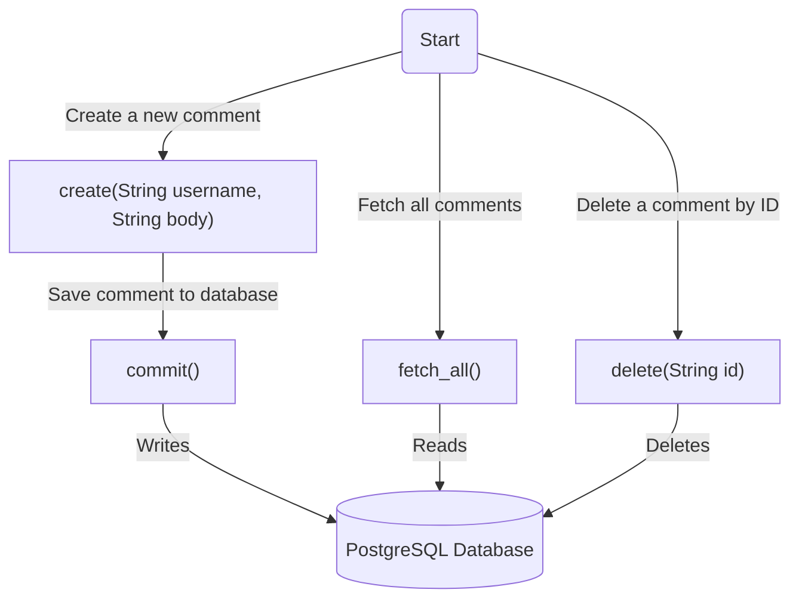
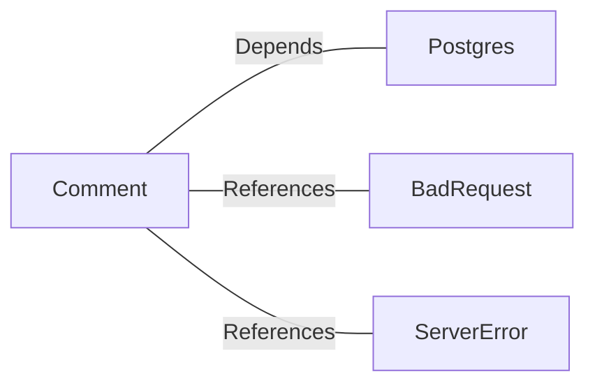

# Comment.java: Comment Management Class

## Overview
The `Comment` class is responsible for managing comments in an application. It provides methods to create, fetch, and delete comments, as well as commit them to a database. The class interacts with a PostgreSQL database to perform CRUD operations on the `comments` table.

## Process Flow

## Insights
- **Comment Creation**: The `create` method generates a new comment with a unique ID and current timestamp, then attempts to save it to the database using the `commit` method.
- **Fetching Comments**: The `fetch_all` method retrieves all comments from the database using a SQL `SELECT` query.
- **Deleting Comments**: The `delete` method removes a comment from the database based on its ID using a SQL `DELETE` query.
- **Database Interaction**: The class heavily relies on the `Postgres.connection()` method to establish connections to the database.
- **Error Handling**: Exceptions are caught and logged, but some methods (e.g., `delete`) always return `false` in the `finally` block, which may override successful operations.
- **SQL Injection Risk**: The `fetch_all` method uses raw SQL queries without parameterization, making it vulnerable to SQL injection attacks.

## Dependencies

- `Postgres`: Provides the `connection()` method to interact with the PostgreSQL database.
- `BadRequest`: Used to throw exceptions when a comment cannot be saved.
- `ServerError`: Used to throw exceptions for server-related errors.

## Data Manipulation (SQL)
### Table: `comments`
| Attribute   | Data Type   | Description                          |
|-------------|-------------|--------------------------------------|
| `id`        | `VARCHAR`   | Unique identifier for the comment.  |
| `username`  | `VARCHAR`   | Username of the comment's author.   |
| `body`      | `TEXT`      | Content of the comment.             |
| `created_on`| `TIMESTAMP` | Timestamp when the comment was created. |

### SQL Operations
- **INSERT**: Adds a new comment to the `comments` table.
- **SELECT**: Retrieves all comments from the `comments` table.
- **DELETE**: Removes a comment from the `comments` table based on its ID.

## Vulnerabilities
1. **SQL Injection**:
   - The `fetch_all` method uses raw SQL queries (`select * from comments;`) without parameterization, exposing the application to SQL injection attacks.
   - Recommendation: Use prepared statements to safely execute SQL queries.

2. **Error Handling in `delete`**:
   - The `delete` method always returns `false` in the `finally` block, even if the operation succeeds.
   - Recommendation: Remove the `return false` statement from the `finally` block to ensure the correct result is returned.

3. **Resource Management**:
   - The `fetch_all` method does not properly close the `Statement` and `ResultSet` objects, which can lead to resource leaks.
   - Recommendation: Use try-with-resources to ensure proper closure of database resources.

4. **Hardcoded SQL Queries**:
   - SQL queries are hardcoded, making them difficult to maintain and prone to errors.
   - Recommendation: Use a query builder or externalize SQL queries for better maintainability.
