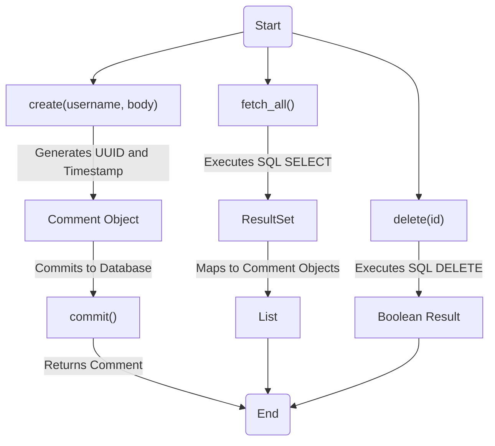
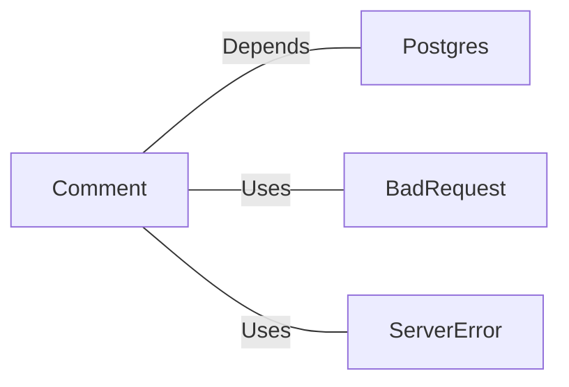

# Comment.java: Comment Management Class

## Overview
The `Comment` class is responsible for managing comments in an application. It provides functionality to create, fetch, and delete comments, as well as commit them to a database. The class interacts with a PostgreSQL database to store and retrieve comment data.

## Process Flow

## Insights
- **Comment Creation**: The `create` method generates a unique ID and timestamp for each comment and commits it to the database. If the commit fails, it throws a `BadRequest` exception.
- **Fetching Comments**: The `fetch_all` method retrieves all comments from the database using a SQL `SELECT` query and maps the results to `Comment` objects.
- **Deleting Comments**: The `delete` method removes a comment from the database based on its ID using a SQL `DELETE` query.
- **Database Interaction**: The class heavily relies on the `Postgres.connection()` method to establish connections to the database.
- **Error Handling**: Exceptions are caught and logged, but some methods (e.g., `delete`) always return `false` in the `finally` block, which may override successful operations.

## Dependencies

- `Postgres`: Provides the `connection()` method to interact with the PostgreSQL database.
- `BadRequest`: Used to throw exceptions when a comment cannot be saved.
- `ServerError`: Used to throw exceptions for server-related errors.

## Data Manipulation (SQL)
### Table Structure: `comments`
| Attribute   | Data Type   | Description                          |
|-------------|-------------|--------------------------------------|
| `id`        | `VARCHAR`   | Unique identifier for the comment.  |
| `username`  | `VARCHAR`   | Username of the comment author.     |
| `body`      | `TEXT`      | Content of the comment.             |
| `created_on`| `TIMESTAMP` | Timestamp when the comment was created. |

### SQL Operations
- **INSERT**: Adds a new comment to the `comments` table.
- **SELECT**: Retrieves all comments from the `comments` table.
- **DELETE**: Removes a comment from the `comments` table based on its ID.

## Vulnerabilities
1. **SQL Injection**:
   - The `fetch_all` method uses raw SQL queries (`stmt.executeQuery(query)`), which are vulnerable to SQL injection. Prepared statements should be used instead.
   
2. **Improper Error Handling**:
   - The `delete` method always returns `false` in the `finally` block, even if the operation succeeds. This can lead to incorrect behavior.
   
3. **Resource Management**:
   - Database connections (`Connection cxn`) and statements (`Statement stmt`) are not properly closed in the `fetch_all` method, which can lead to resource leaks.
   
4. **Unvalidated Input**:
   - The `create` method does not validate `username` or `body` inputs, which could lead to issues like storing malicious data in the database.

5. **Hardcoded SQL Queries**:
   - SQL queries are hardcoded, making them difficult to maintain and prone to errors if the database schema changes.
