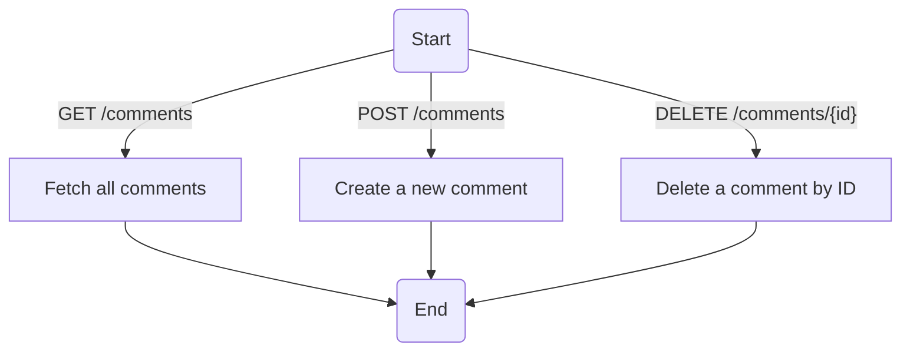
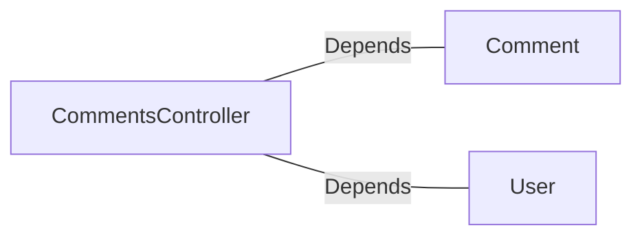

# CommentsController.java: REST API for Comment Management

## Overview
This file defines a Spring Boot REST controller for managing comments. It provides endpoints to fetch, create, and delete comments. The controller includes basic authentication using a secret token and handles errors with custom exceptions.

## Process Flow

## Insights
- **Authentication**: The controller uses a secret token (`x-auth-token`) for authentication, validated via `User.assertAuth`.
- **Endpoints**:
  - `GET /comments`: Fetches all comments.
  - `POST /comments`: Creates a new comment using the `CommentRequest` payload.
  - `DELETE /comments/{id}`: Deletes a comment by its ID.
- **Cross-Origin Resource Sharing (CORS)**: All endpoints allow requests from any origin (`@CrossOrigin(origins = "*")`).
- **Error Handling**: Custom exceptions (`BadRequest`, `ServerError`) are used to handle specific HTTP error responses.
- **Data Structure**: `CommentRequest` is a simple data structure for creating comments, containing `username` and `body`.

## Dependencies

- `Comment`: Handles operations related to comments, such as fetching, creating, and deleting.
- `User`: Provides authentication functionality (`assertAuth`).

## Vulnerabilities
1. **Hardcoded Secret**: The `secret` is injected via `@Value("${app.secret}")`. If the secret is not securely stored or rotated, it could lead to security risks.
2. **CORS Policy**: Allowing all origins (`@CrossOrigin(origins = "*")`) can expose the API to potential abuse from malicious domains.
3. **Authentication Bypass**: The `User.assertAuth` method is used for authentication, but its implementation is not shown. If it is weak or improperly implemented, it could lead to unauthorized access.
4. **Error Handling**: The custom exceptions (`BadRequest`, `ServerError`) do not provide detailed error messages or logging, which could make debugging difficult.
5. **Input Validation**: The `CommentRequest` class does not validate `username` or `body`. This could lead to injection attacks or invalid data being processed.
6. **No Rate Limiting**: The endpoints do not implement rate limiting, making them susceptible to abuse via brute force or denial-of-service attacks.

## Data Manipulation (SQL)
- **Comment**: Likely interacts with a database to perform operations such as fetching, creating, and deleting comments. However, the exact SQL operations are not shown in the code.
