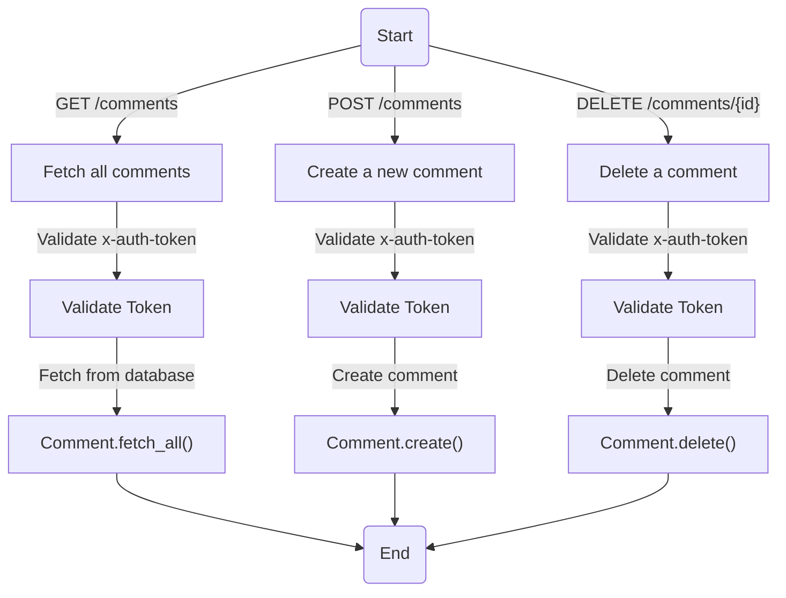
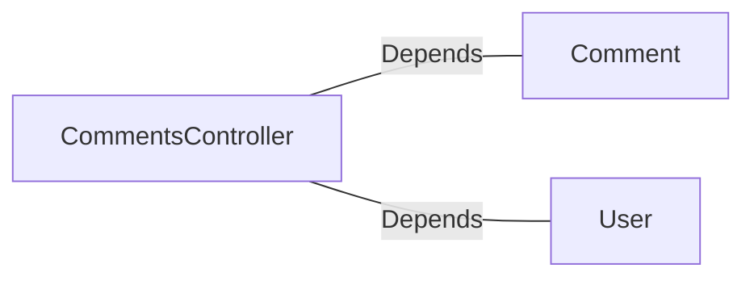

# CommentsController.java: REST API for Comment Management

## Overview
This file defines a Spring Boot REST controller for managing comments. It provides endpoints to fetch all comments, create a new comment, and delete an existing comment. The controller includes authentication via a custom token mechanism and handles errors with custom exceptions.

## Process Flow

## Insights
- **Authentication**: The controller uses a custom token-based authentication mechanism (`x-auth-token`) validated against a secret value (`app.secret`).
- **Endpoints**:
  - `GET /comments`: Fetches all comments.
  - `POST /comments`: Creates a new comment with a username and body.
  - `DELETE /comments/{id}`: Deletes a comment by its ID.
- **Cross-Origin Resource Sharing (CORS)**: All endpoints allow requests from any origin (`@CrossOrigin(origins = "*")`).
- **Error Handling**: Custom exceptions (`BadRequest`, `ServerError`) are used to handle specific error scenarios with appropriate HTTP status codes.
- **Data Structure**: The `CommentRequest` class is used to encapsulate the request body for creating comments.

## Dependencies

- `Comment`: Handles operations related to comments, such as fetching, creating, and deleting.
- `User`: Provides authentication functionality (`assertAuth`).

## Vulnerabilities
1. **Hardcoded Secret**: The `secret` value is injected from application properties (`app.secret`). If this value is not securely stored or rotated, it could lead to security risks.
2. **CORS Policy**: Allowing all origins (`@CrossOrigin(origins = "*")`) can expose the API to potential abuse from malicious domains.
3. **Authentication Bypass**: The `assertAuth` method in `User` is assumed to validate the token securely. If this method is not implemented properly, it could lead to authentication bypass.
4. **Error Handling**: The custom exceptions (`BadRequest`, `ServerError`) do not provide detailed error messages, which could make debugging difficult.
5. **Input Validation**: The `CommentRequest` class does not validate the `username` or `body` fields, potentially allowing malicious input (e.g., SQL injection, XSS).
6. **No Rate Limiting**: The endpoints do not implement rate limiting, making them vulnerable to brute force or denial-of-service attacks.

## Data Manipulation (SQL)
- **Comment.fetch_all()**: Likely performs a `SELECT` operation to retrieve all comments.
- **Comment.create()**: Likely performs an `INSERT` operation to add a new comment.
- **Comment.delete()**: Likely performs a `DELETE` operation to remove a comment by ID.

If the `Comment` class interacts with a database, the following attributes might be expected:
| Attribute   | Type       | Description                     |
|-------------|------------|---------------------------------|
| `id`        | String     | Unique identifier for the comment |
| `username`  | String     | Username of the comment author   |
| `body`      | String     | Content of the comment           |
| `timestamp` | DateTime   | Timestamp of when the comment was created |
