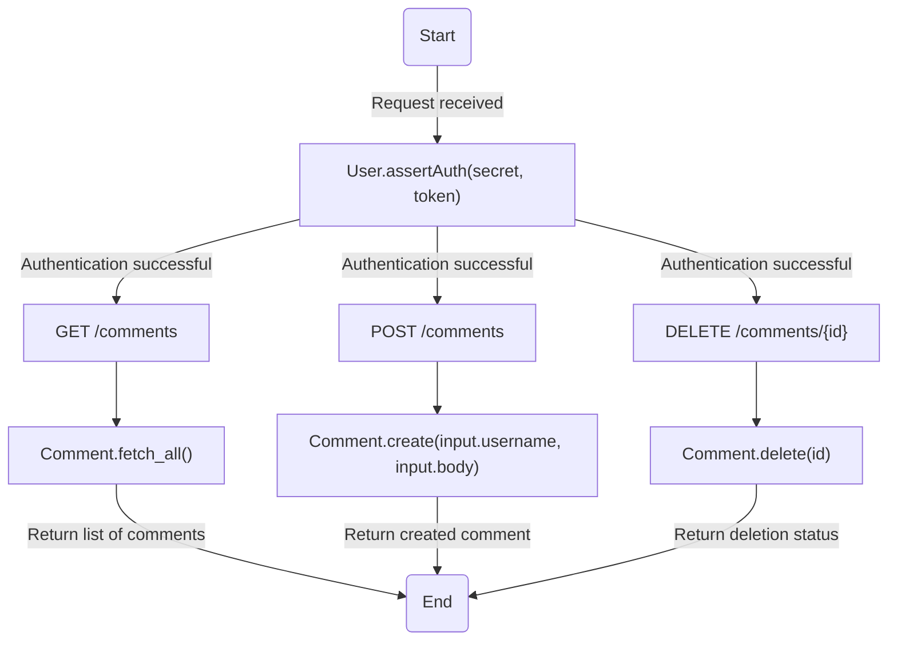
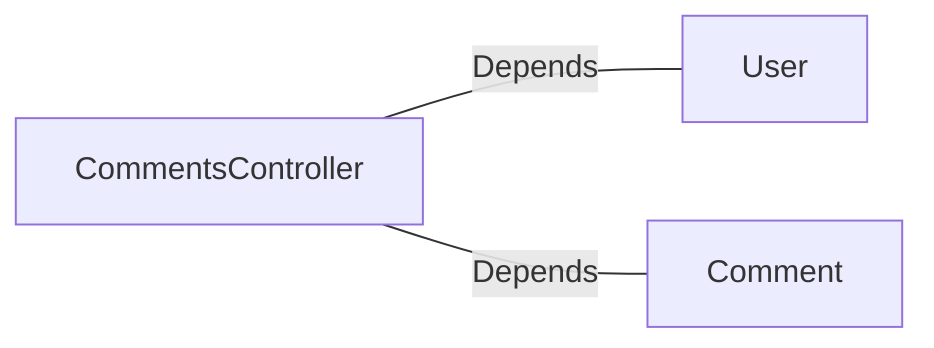

# CommentsController.java: REST API for Managing Comments

## Overview
This file defines a REST API controller for managing comments. It provides endpoints to fetch all comments, create a new comment, and delete an existing comment. The controller uses Spring Boot annotations for configuration and handles HTTP requests with JSON payloads. It also includes custom exception handling for bad requests and server errors.

## Process Flow

## Insights
- **Authentication**: The `x-auth-token` header is used for authentication, validated by `User.assertAuth(secret, token)`.
- **Endpoints**:
  - `GET /comments`: Fetches all comments.
  - `POST /comments`: Creates a new comment with `username` and `body` provided in the request body.
  - `DELETE /comments/{id}`: Deletes a comment by its ID.
- **Cross-Origin Resource Sharing (CORS)**: All endpoints allow requests from any origin (`@CrossOrigin(origins = "*")`).
- **Error Handling**:
  - `BadRequest`: Returns HTTP 400 for invalid requests.
  - `ServerError`: Returns HTTP 500 for server-side errors.
- **Data Structure**:
  - `CommentRequest`: Serializable class with `username` and `body` attributes for creating comments.

## Dependencies

- `User`: Used for authentication via `assertAuth(secret, token)`.
- `Comment`: Provides methods for fetching, creating, and deleting comments.

### List of Identified External References
- `User`: Validates the authentication token using the secret key.
- `Comment`: 
  - `fetch_all()`: Retrieves all comments.
  - `create(username, body)`: Creates a new comment.
  - `delete(id)`: Deletes a comment by its ID.

## Vulnerabilities
1. **Hardcoded Secret Exposure**:
   - The `secret` is injected from the application properties (`@Value("${app.secret}")`). If improperly secured, it could be exposed, leading to authentication bypass.
   - Recommendation: Use environment variables or a secure vault to store sensitive secrets.

2. **CORS Misconfiguration**:
   - Allowing all origins (`@CrossOrigin(origins = "*")`) can expose the API to potential abuse from malicious domains.
   - Recommendation: Restrict origins to trusted domains.

3. **Authentication Logic**:
   - The `User.assertAuth(secret, token)` method is called but its implementation is not shown. If it lacks proper validation mechanisms, it could lead to unauthorized access.
   - Recommendation: Ensure robust token validation and expiration checks.

4. **Error Handling**:
   - The custom exceptions (`BadRequest` and `ServerError`) do not log the errors. This could make debugging and monitoring difficult.
   - Recommendation: Log exceptions with relevant details for better traceability.

5. **Input Validation**:
   - The `CommentRequest` class does not validate `username` or `body`. This could lead to injection attacks or invalid data being processed.
   - Recommendation: Add validation for input fields to prevent malicious data.

6. **No Rate Limiting**:
   - The API does not implement rate limiting, making it vulnerable to brute force or denial-of-service attacks.
   - Recommendation: Implement rate limiting to mitigate abuse.

7. **No Authorization Checks**:
   - The API assumes that authentication is sufficient but does not check user roles or permissions for actions like deleting comments.
   - Recommendation: Implement role-based access control (RBAC) for sensitive operations.
