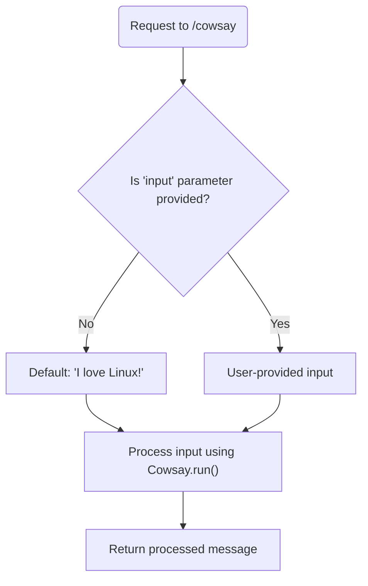
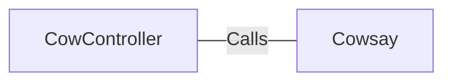

# CowController.java: REST Controller for CowSay Functionality

## Overview
The `CowController` class is a Spring Boot REST controller that provides an endpoint for generating "cowsay" messages. It accepts user input via a query parameter and processes it using the `Cowsay.run()` method.

## Process Flow

## Insights
- The `CowController` class is annotated with `@RestController` and `@EnableAutoConfiguration`, making it a Spring Boot REST controller with auto-configuration enabled.
- The `/cowsay` endpoint accepts a query parameter `input`. If no input is provided, it defaults to "I love Linux!".
- The `Cowsay.run()` method is used to process the input, but its implementation is not provided in this snippet.
- The class does not include any validation or sanitization for the `input` parameter, which could lead to potential security vulnerabilities.

## Vulnerabilities
1. **Potential Command Injection**:
   - If the `Cowsay.run()` method executes system commands or interacts with external processes, the lack of input sanitization could allow malicious input to exploit the system.
   - Example: If `input` contains special characters or command sequences, it could lead to unintended behavior or security breaches.

2. **Denial of Service (DoS)**:
   - The endpoint does not limit the size or complexity of the `input` parameter. A very large or complex input could cause performance degradation or crash the application.

3. **Cross-Site Scripting (XSS)**:
   - If the `Cowsay.run()` method returns unescaped user input, it could lead to XSS vulnerabilities when the response is rendered in a browser.

## Dependencies

- `Cowsay`: Processes the input parameter and generates the "cowsay" message.

## Data Manipulation (SQL) (Optional)
No SQL-related operations or data manipulations are present in this code snippet.
