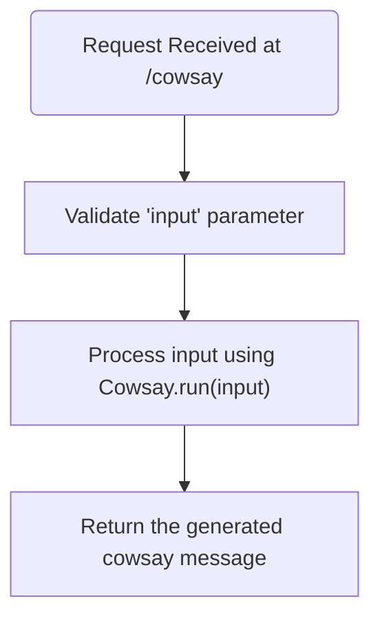
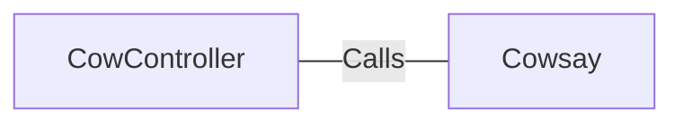

# CowController.java: REST Controller for CowSay Functionality

## Overview
The `CowController` class is a Spring Boot REST controller that provides an endpoint for generating "cowsay" messages. It accepts user input via a query parameter and processes it using the `Cowsay.run()` method.

## Process Flow

## Insights
- The class is annotated with `@RestController` and `@EnableAutoConfiguration`, making it a Spring Boot REST controller with auto-configuration enabled.
- The `/cowsay` endpoint accepts a query parameter `input` with a default value of `"I love Linux!"`.
- The `Cowsay.run()` method is used to process the input and generate the cowsay message.
- The `input` parameter is directly passed to `Cowsay.run()` without sanitization, which could lead to potential vulnerabilities.

## Vulnerabilities
1. **Potential Command Injection**:
   - If the `Cowsay.run()` method executes system commands or interacts with external processes, passing unsanitized user input directly could lead to command injection vulnerabilities.
   - Mitigation: Validate and sanitize the `input` parameter to ensure it does not contain malicious content.

2. **Denial of Service (DoS)**:
   - If the `Cowsay.run()` method performs resource-intensive operations, an attacker could exploit this by sending large or complex inputs repeatedly.
   - Mitigation: Implement input size restrictions and rate limiting.

3. **Cross-Site Scripting (XSS)**:
   - If the generated cowsay message is displayed in a web application without proper escaping, it could lead to XSS attacks.
   - Mitigation: Escape the output before rendering it in a web application.

## Dependencies

- `Cowsay`: Processes the input parameter to generate the cowsay message.

## Data Manipulation (SQL) (Optional)
No SQL-related operations are detected in this code.
