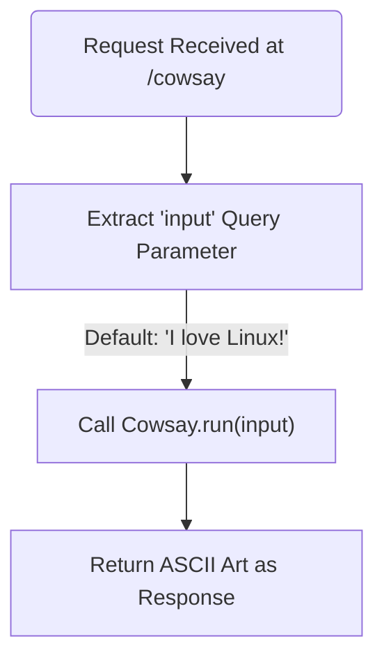
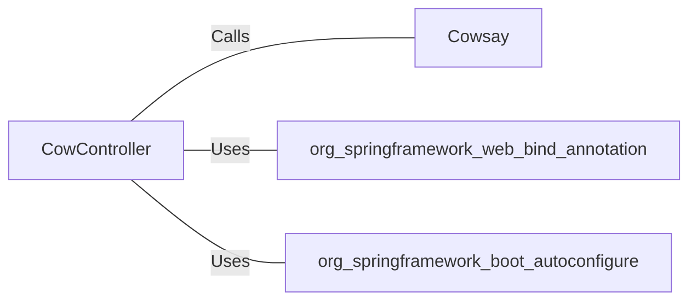

# CowController.java: REST Controller for Cowsay Functionality

## Overview
The `CowController` class is a REST controller that provides an endpoint to generate ASCII art using the `Cowsay` utility. It accepts user input via a query parameter and returns the corresponding ASCII art.

## Process Flow

## Insights
- The `/cowsay` endpoint is exposed as a REST API.
- The `input` query parameter is used to customize the message displayed by the `Cowsay` ASCII art. If not provided, it defaults to `"I love Linux!"`.
- The `Cowsay.run` method is invoked to generate the ASCII art.
- The class uses Spring Boot annotations to configure and expose the REST endpoint.

## Dependencies

- `Cowsay`: Generates ASCII art based on the input string. The exact implementation of `Cowsay` is not provided in this snippet.
- `org.springframework.web.bind.annotation`: Provides annotations for REST controller and request mapping.
- `org.springframework.boot.autoconfigure`: Enables Spring Boot auto-configuration.

## Vulnerabilities
- **Potential Command Injection**: If the `Cowsay.run` method executes system commands or interacts with external processes, the `input` parameter could be exploited for command injection. Proper sanitization and validation of the `input` parameter are necessary to mitigate this risk.
- **Denial of Service (DoS)**: If the `Cowsay.run` method processes large or complex inputs without limits, it could lead to resource exhaustion.
- **Lack of Input Validation**: The `input` parameter is directly passed to `Cowsay.run` without validation. This could lead to unexpected behavior or security vulnerabilities depending on the implementation of `Cowsay.run`.
