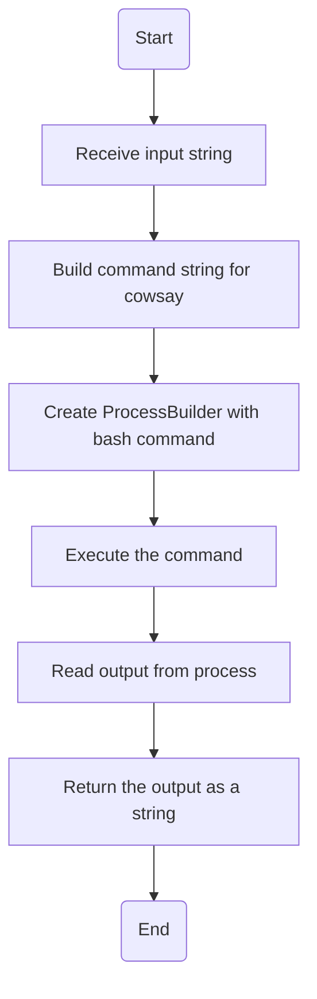
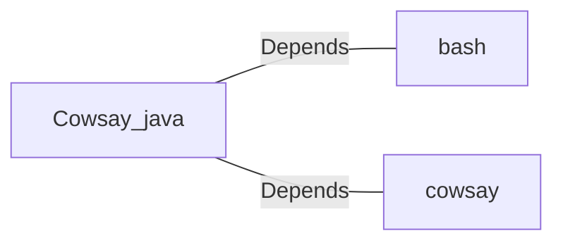

# Cowsay.java: Command Execution Wrapper for Cowsay

## Overview
This program provides a wrapper for executing the `cowsay` command-line utility, which generates ASCII art of a cow saying a given input message. The program uses Java's `ProcessBuilder` to execute the command and capture its output.

## Process Flow

## Insights
- The program dynamically constructs a shell command to execute the `cowsay` utility.
- It uses `ProcessBuilder` to execute the command and capture its output.
- The program does not sanitize the input, which could lead to command injection vulnerabilities.
- The output of the `cowsay` command is read line by line and appended to a `StringBuilder`.

## Vulnerabilities
1. **Command Injection**:
   - The input string is directly concatenated into the command string without any sanitization or validation.
   - An attacker could inject malicious shell commands by providing specially crafted input.
   - Example: If the input is `"; rm -rf /"`, the resulting command would execute `rm -rf /` on the system.

2. **Error Handling**:
   - The program catches exceptions but only prints the stack trace. It does not provide meaningful error handling or feedback to the caller.

3. **Dependency on External Command**:
   - The program assumes the `cowsay` utility is installed at `/usr/games/cowsay`. If it is not available, the program will fail.

## Dependencies

- `bash`: Used to execute the constructed shell command.
- `cowsay`: The external utility that generates ASCII art of a cow saying the input message.

## Recommendations
- **Input Sanitization**: Validate and sanitize the input to prevent command injection.
- **Error Handling**: Improve error handling to provide meaningful feedback to the caller.
- **Dependency Check**: Verify the presence of the `cowsay` utility before attempting to execute it.
- **Alternative Implementation**: Consider using a Java library or implementing the functionality directly in Java to avoid reliance on external commands.
