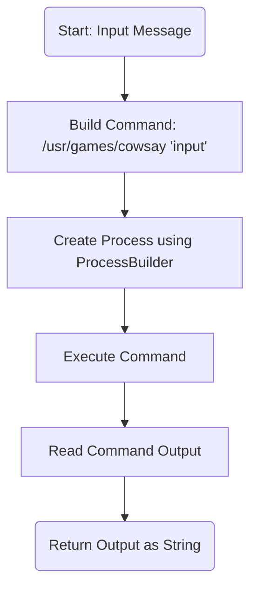
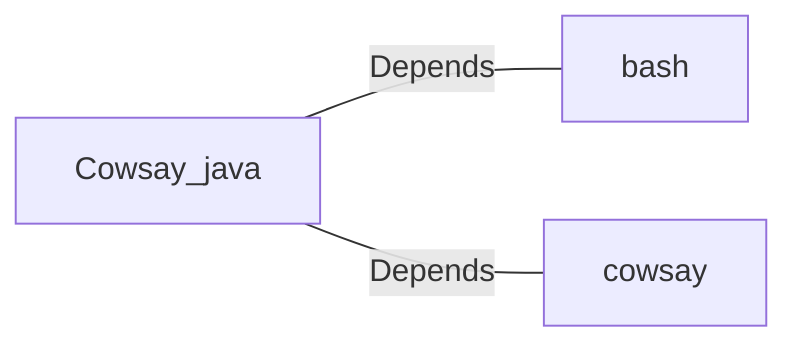

# Cowsay.java: Command Execution Wrapper for Cowsay

## Overview
The `Cowsay` class provides functionality to execute the `cowsay` command-line tool, which generates ASCII art of a cow saying a given input message. It uses Java's `ProcessBuilder` to execute the command and captures the output.

## Process Flow

## Insights
- The program dynamically constructs a shell command using the input string and executes it using `ProcessBuilder`.
- The `cowsay` command is expected to be installed at `/usr/games/cowsay` on the system where this code runs.
- The output of the command is captured and returned as a string.
- The program does not sanitize the input, which can lead to command injection vulnerabilities.

## Vulnerabilities
1. **Command Injection**:
   - The input string is directly concatenated into the shell command without validation or sanitization.
   - Malicious input such as `"; rm -rf /"` could execute arbitrary commands on the host system.
   - Example exploit: Passing `"; ls -la"` as input would execute `ls -la` in addition to the `cowsay` command.

2. **Error Handling**:
   - The program catches exceptions but only prints the stack trace. It does not provide meaningful error handling or feedback to the caller.

3. **Dependency on System Configuration**:
   - The program assumes the `cowsay` binary is located at `/usr/games/cowsay`. If the binary is not present or located elsewhere, the program will fail.

## Dependencies

- `bash`: Used to execute the constructed shell command.
- `cowsay`: The external command-line tool that generates ASCII art.

## Recommendations
- **Input Sanitization**: Validate and sanitize the input to prevent command injection.
- **Error Handling**: Implement proper error handling to provide meaningful feedback to the caller.
- **Configuration Flexibility**: Allow the path to the `cowsay` binary to be configurable instead of hardcoding it.
- **Security Measures**: Use safer alternatives like `ProcessBuilder` arguments to avoid shell command execution.
