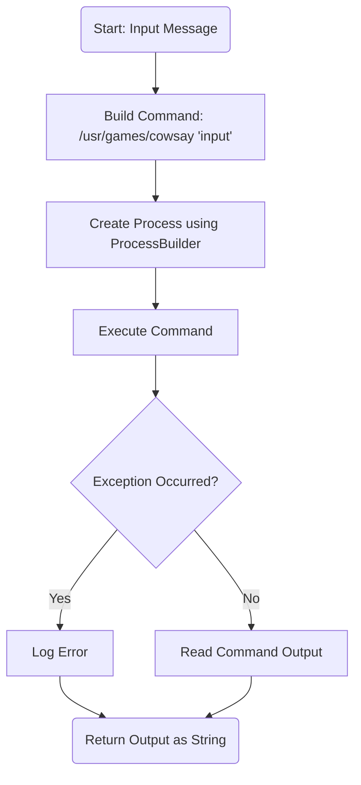
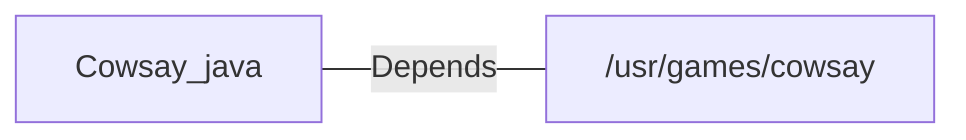

# Cowsay.java: Command Execution Wrapper for Cowsay

## Overview
The `Cowsay` class provides functionality to execute the `cowsay` command-line tool, which generates ASCII art of a cow saying a given input message. It uses Java's `ProcessBuilder` to execute the command and captures the output.

## Process Flow

## Insights
- The program dynamically constructs a shell command using user-provided input, which is then executed using `ProcessBuilder`.
- The `cowsay` command is expected to be installed at `/usr/games/cowsay` on the system.
- The output of the command is captured and returned as a string.
- Exception handling is present but limited to printing stack traces, which may not be ideal for production environments.

## Vulnerabilities
1. **Command Injection**:
   - The input is directly concatenated into the shell command without sanitization, making the program vulnerable to command injection attacks. For example, an input like `"; rm -rf /"` could execute malicious commands.
   - **Mitigation**: Use safer methods to pass arguments to the command, such as `processBuilder.command()` with individual arguments instead of concatenating strings.

2. **Hardcoded Command Path**:
   - The path `/usr/games/cowsay` is hardcoded, which may not be valid on all systems.
   - **Mitigation**: Validate the existence of the command or allow configuration of the path.

3. **Limited Exception Handling**:
   - Exceptions are only logged using `e.printStackTrace()`, which may expose sensitive information in logs.
   - **Mitigation**: Implement proper error handling and logging mechanisms.

4. **Dependency on External Command**:
   - The program relies on the external `cowsay` command, which must be installed on the system. If unavailable, the program will fail.
   - **Mitigation**: Validate the presence of the command during initialization or provide fallback behavior.

## Dependencies

- `/usr/games/cowsay`: The external command-line tool used to generate ASCII art. The program depends on this tool being installed and accessible at the specified path.

## Data Manipulation (SQL)
No SQL or database-related operations are present in this code.
