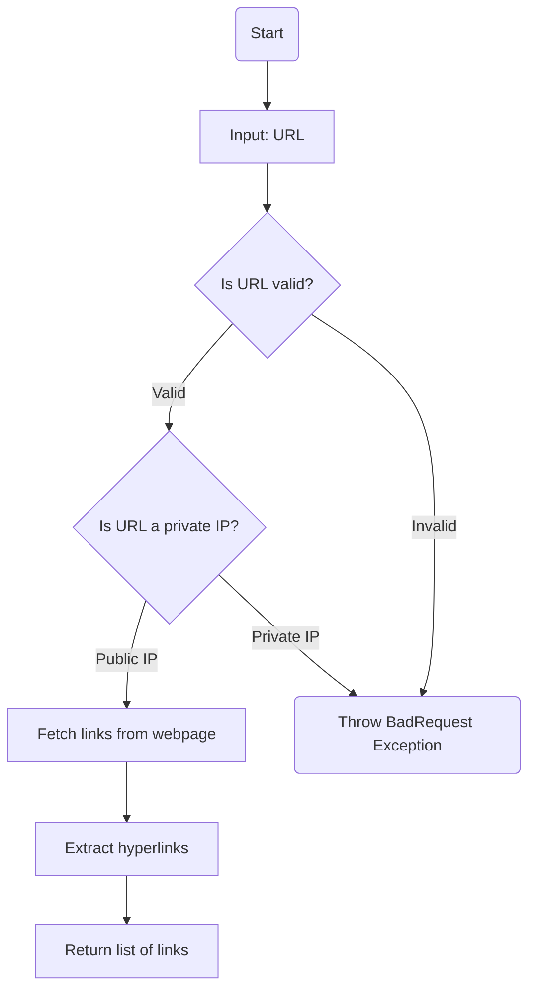
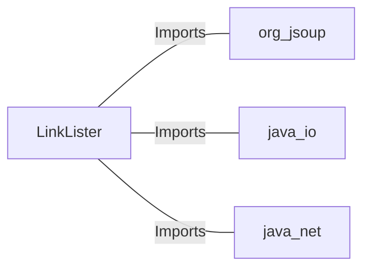

# LinkLister.java: Web Link Extractor

## Overview
The `LinkLister` class is designed to extract hyperlinks from a given webpage URL. It provides two methods for retrieving links:
1. `getLinks`: Extracts all hyperlinks from the provided URL.
2. `getLinksV2`: Adds validation to ensure the URL does not point to private IP addresses before extracting links.

## Process Flow

## Insights
- **Private IP Validation**: The `getLinksV2` method ensures that URLs pointing to private IP addresses are rejected for security reasons.
- **HTML Parsing**: The class uses the `Jsoup` library to parse HTML and extract hyperlinks.
- **Error Handling**: The `getLinksV2` method throws a custom `BadRequest` exception for invalid URLs or private IPs.
- **Potential Vulnerability**: The `getLinks` method does not validate the input URL, which could lead to security risks such as SSRF (Server-Side Request Forgery).

## Vulnerabilities
1. **SSRF (Server-Side Request Forgery)**:
   - The `getLinks` method directly connects to the provided URL without validation, making it susceptible to SSRF attacks.
   - An attacker could exploit this by providing a malicious URL that targets internal services or sensitive endpoints.

2. **Unvalidated Input**:
   - The `getLinks` method does not validate the format or content of the input URL, which could lead to unexpected behavior or errors.

3. **Error Disclosure**:
   - The `getLinksV2` method exposes exception messages directly via `BadRequest(e.getMessage())`. This could leak sensitive information about the application's internal workings.

## Dependencies

- `org.jsoup`: Used for HTML parsing and extracting elements from the webpage.
- `java.io`: Used for handling input/output operations.
- `java.net`: Used for URL validation and manipulation.

## Data Manipulation (SQL)
Not applicable. This code does not interact with any database or perform SQL operations.
