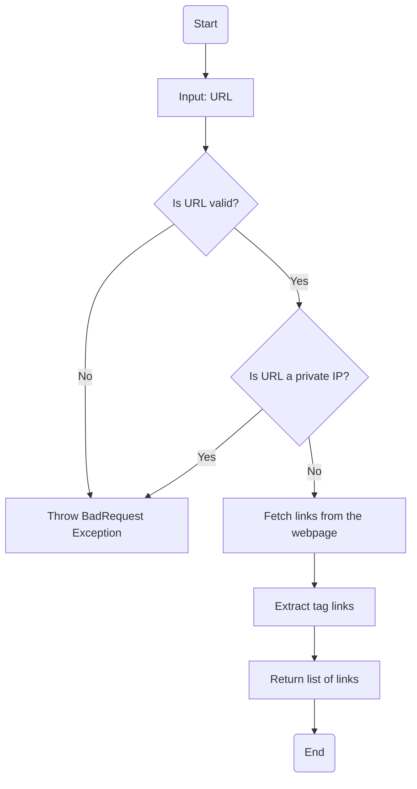
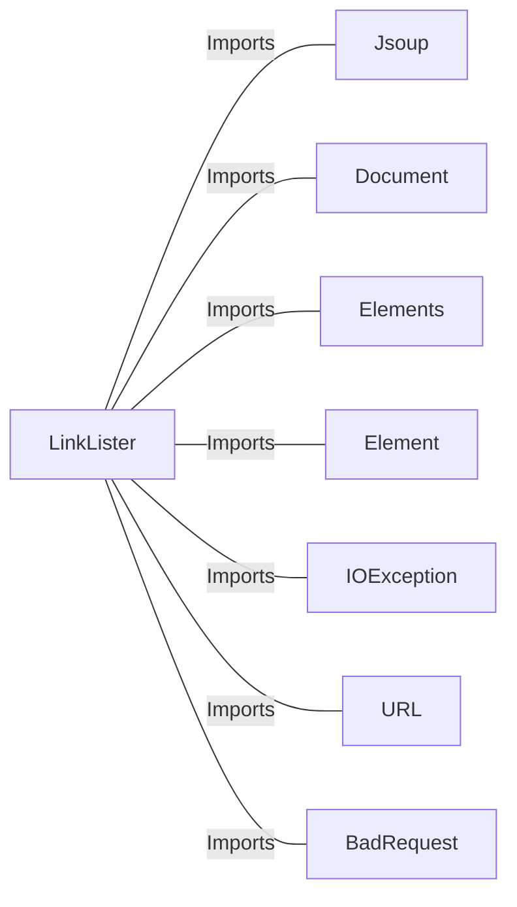

# LinkLister.java: Web Link Extractor with IP Validation

## Overview

The `LinkLister` class is designed to extract all hyperlinks (`<a>` tags) from a given webpage URL. It provides two methods for this purpose:
1. `getLinks(String url)`: Extracts all hyperlinks from the provided URL.
2. `getLinksV2(String url)`: Adds an additional layer of validation to prevent the use of private IP addresses in the URL.

## Process Flow

## Insights

- **Core Functionality**:
  - The `getLinks` method uses the `Jsoup` library to parse the HTML content of a webpage and extract all hyperlinks (`<a>` tags).
  - The `getLinksV2` method extends the functionality of `getLinks` by adding a validation step to block URLs that resolve to private IP addresses.

- **Private IP Validation**:
  - The `getLinksV2` method checks if the URL's host starts with private IP address ranges (`172.`, `192.168`, or `10.`). If so, it throws a `BadRequest` exception.

- **Error Handling**:
  - The `getLinksV2` method wraps the logic in a `try-catch` block to handle exceptions and rethrows them as `BadRequest` exceptions.

- **Security Considerations**:
  - The `getLinksV2` method mitigates potential SSRF (Server-Side Request Forgery) attacks by blocking private IP addresses.

## Dependencies

- `Jsoup`: Used for parsing HTML and extracting elements.
- `Document`: Represents the parsed HTML document.
- `Elements`: Represents a collection of HTML elements.
- `Element`: Represents a single HTML element.
- `IOException`: Handles input/output exceptions during URL connection.
- `URL`: Used for URL validation and parsing.
- `BadRequest`: Custom exception class for handling invalid requests.

## Vulnerabilities

1. **SSRF (Server-Side Request Forgery)**:
   - The `getLinks` method does not validate the URL, making it vulnerable to SSRF attacks. An attacker could use this method to access internal resources by providing a malicious URL.
   - Mitigation: Use the private IP validation logic from `getLinksV2` in `getLinks` as well.

2. **Unrestricted URL Access**:
   - The `getLinks` method allows unrestricted access to any URL, including potentially malicious or sensitive URLs.
   - Mitigation: Implement a whitelist of allowed domains or validate URLs against a set of rules.

3. **Lack of Timeout Configuration**:
   - The `Jsoup.connect(url).get()` call does not specify a timeout, which could lead to indefinite hanging if the server does not respond.
   - Mitigation: Configure a timeout using `Jsoup.connect(url).timeout(milliseconds)`.

4. **Error Message Exposure**:
   - The `getLinksV2` method rethrows exceptions with the original message, which could expose sensitive information about the system.
   - Mitigation: Log the original exception internally and return a generic error message to the user.

5. **Potential NullPointerException**:
   - If the `absUrl("href")` method in `getLinks` encounters a malformed or missing `href` attribute, it could result in a `NullPointerException`.
   - Mitigation: Add a null check before adding the link to the result list.

## Data Manipulation (SQL) (Optional)

No SQL or database-related operations are present in this code.
