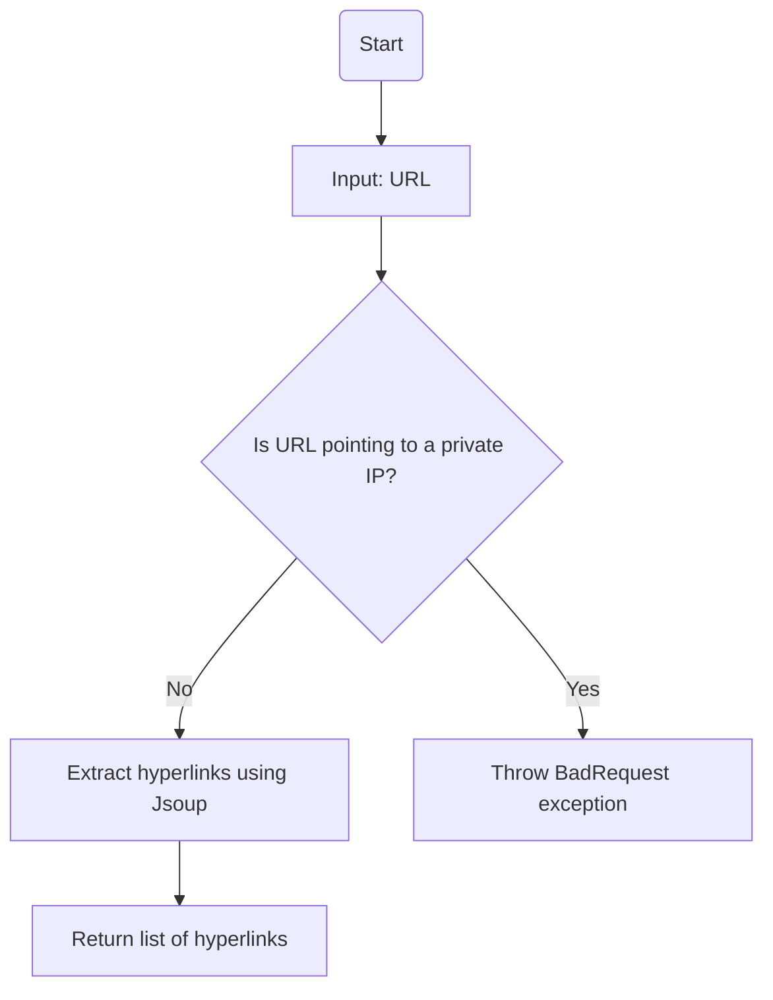
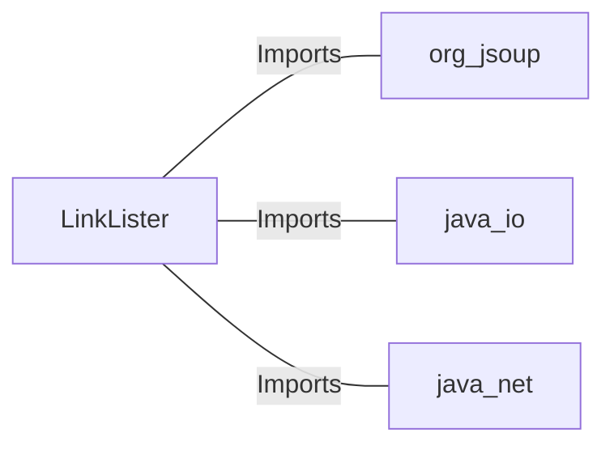

# LinkLister.java: URL Link Extraction and Validation

## Overview
The `LinkLister` class is responsible for extracting hyperlinks from a given URL and validating the URL to ensure it does not point to private IP addresses. It provides two main methods:
1. `getLinks(String url)`: Extracts all hyperlinks from the provided URL.
2. `getLinksV2(String url)`: Validates the URL to ensure it does not point to private IP addresses before extracting hyperlinks.

## Process Flow

## Insights
- **Private IP Validation**: The `getLinksV2` method ensures that URLs pointing to private IP addresses are rejected, enhancing security by preventing access to internal resources.
- **Hyperlink Extraction**: The `getLinks` method uses the Jsoup library to parse the HTML content of the provided URL and extract all hyperlinks.
- **Error Handling**: The `getLinksV2` method wraps potential exceptions in a custom `BadRequest` exception, providing meaningful error messages.
- **Potential Vulnerability**: The `getLinks` method does not validate the URL, which could lead to security risks such as SSRF (Server-Side Request Forgery) if used improperly.

## Vulnerabilities
1. **SSRF (Server-Side Request Forgery)**:
   - The `getLinks` method directly connects to the provided URL without validation, which could allow an attacker to exploit SSRF by providing malicious URLs.
   - Mitigation: Validate the URL before connecting, similar to the checks in `getLinksV2`.

2. **Private IP Validation Bypass**:
   - The `getLinksV2` method only checks for specific private IP ranges (`172.`, `192.168`, `10.`). It does not account for other private or reserved IP ranges (e.g., `127.0.0.1`, `169.254.x.x`, or IPv6 private addresses).
   - Mitigation: Expand the validation logic to cover all private and reserved IP ranges.

3. **Error Handling**:
   - The `getLinksV2` method catches all exceptions and wraps them in a `BadRequest` exception. This could lead to exposing internal error messages to the user.
   - Mitigation: Log the detailed error internally and provide a generic error message to the user.

## Dependencies

- `org.jsoup`: Used for parsing HTML and extracting hyperlinks.
- `java.io`: Used for handling input/output operations.
- `java.net`: Used for URL validation and manipulation.

## Data Manipulation (SQL) (Optional)
No SQL-related operations are performed in this code.
