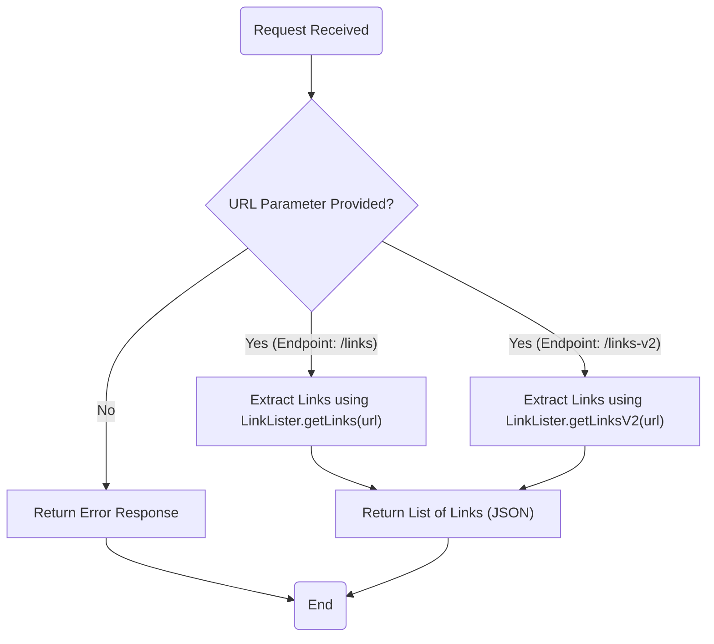
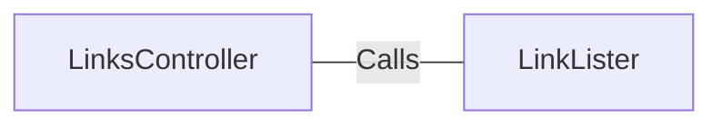

# LinksController.java: REST Controller for Link Extraction

## Overview
The `LinksController` class is a REST controller that provides endpoints to extract links from a given URL. It exposes two endpoints (`/links` and `/links-v2`) that process a URL parameter and return a list of links in JSON format. The class uses the `LinkLister` utility to perform the actual link extraction.

## Process Flow

## Insights
- The class is annotated with `@RestController` and `@EnableAutoConfiguration`, making it a Spring Boot REST controller with automatic configuration.
- Two endpoints are defined:
  - `/links`: Uses `LinkLister.getLinks(url)` to extract links.
  - `/links-v2`: Uses `LinkLister.getLinksV2(url)` to extract links.
- Both endpoints expect a `url` query parameter and return a list of links in JSON format.
- The `/links-v2` endpoint throws a custom `BadRequest` exception, while `/links` throws an `IOException`.
- The `LinkLister` utility is a dependency for link extraction, but its implementation is not provided in the code snippet.

## Dependencies

- `LinkLister`: Provides the `getLinks(url)` and `getLinksV2(url)` methods for extracting links from the given URL.

## Vulnerabilities
1. **Potential for Open Redirect or SSRF (Server-Side Request Forgery):**
   - The `url` parameter is directly passed to the `LinkLister` utility without validation or sanitization. This could allow malicious URLs to be processed, leading to SSRF attacks or other vulnerabilities.

2. **Lack of Input Validation:**
   - There is no validation to ensure that the `url` parameter is a well-formed and safe URL. This could lead to unexpected behavior or security issues.

3. **Error Handling:**
   - The `/links` endpoint throws a generic `IOException`, which may expose internal details of the application if not properly handled.
   - The `/links-v2` endpoint throws a `BadRequest` exception, but the implementation of this exception is not provided, leaving its behavior unclear.

4. **Dependency on `LinkLister`:**
   - The security and reliability of the endpoints depend heavily on the implementation of the `LinkLister` utility, which is not included in the code snippet. If `LinkLister` has vulnerabilities, they could propagate to this controller.

5. **No Authentication or Authorization:**
   - The endpoints are publicly accessible without any authentication or authorization, which could expose the application to abuse or unauthorized use.

## Recommendations
- Validate and sanitize the `url` parameter to ensure it is a well-formed and safe URL.
- Implement proper error handling to avoid exposing internal details of the application.
- Add authentication and authorization to restrict access to the endpoints.
- Review the implementation of the `LinkLister` utility to ensure it is secure and reliable.
- Consider rate-limiting or other measures to prevent abuse of the endpoints.
