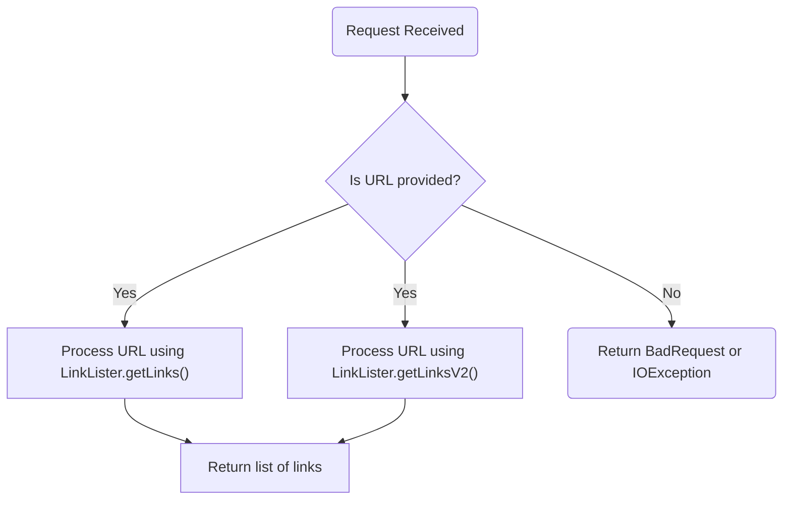
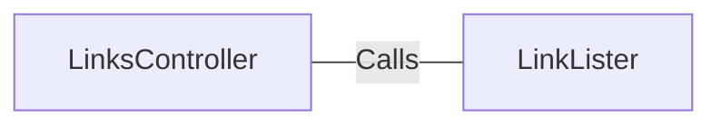

# LinksController.java: REST API for Extracting Links

## Overview
The `LinksController` class is a REST API controller that provides endpoints for extracting links from a given URL. It uses the `LinkLister` utility to process the URL and return a list of links. The class is built using Spring Boot and supports two endpoints: `/links` and `/links-v2`.

## Process Flow

## Insights
- The class defines two endpoints:
  - `/links`: Extracts links using `LinkLister.getLinks(url)` and may throw an `IOException`.
  - `/links-v2`: Extracts links using `LinkLister.getLinksV2(url)` and may throw a `BadRequest` exception.
- Both endpoints require a `url` parameter to be provided via query string.
- The `LinkLister` utility is responsible for the actual link extraction logic.
- The class uses Spring Boot annotations for REST API functionality:
  - `@RestController`: Marks the class as a REST controller.
  - `@EnableAutoConfiguration`: Enables Spring Boot's auto-configuration.
  - `@RequestMapping`: Maps HTTP requests to handler methods.

## Dependencies

- `LinkLister`: Utility class responsible for extracting links from the provided URL. The methods `getLinks(url)` and `getLinksV2(url)` are invoked by the controller.

## Vulnerabilities
- **Potential Security Risk**: The `url` parameter is directly passed to the `LinkLister` methods without validation or sanitization. This could lead to vulnerabilities such as Server-Side Request Forgery (SSRF) or injection attacks if the `LinkLister` implementation does not properly handle malicious URLs.
- **Error Handling**: The `/links` endpoint may throw an `IOException`, but the controller does not provide a mechanism to handle this exception gracefully, potentially exposing internal server errors to the client.
- **BadRequest Exception**: The `/links-v2` endpoint relies on a custom `BadRequest` exception, but its implementation and handling are not shown, which could lead to inconsistent error responses.

## Recommendations
- Validate and sanitize the `url` parameter to prevent SSRF and other injection attacks.
- Implement proper exception handling to ensure meaningful and secure error responses.
- Document the behavior and structure of the `BadRequest` exception for consistency across the application.
