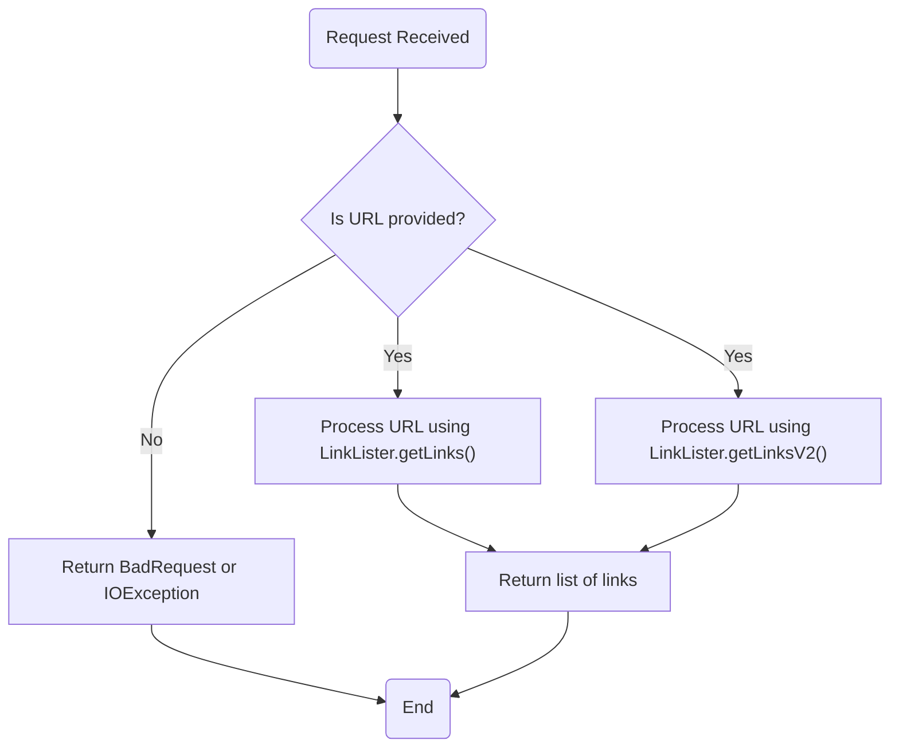
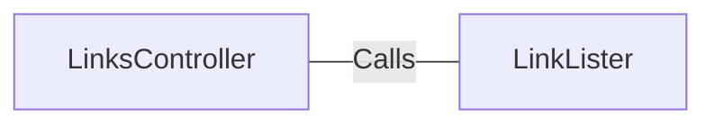

# LinksController.java: REST Controller for Link Listing

## Overview
The `LinksController` class is a REST controller that provides endpoints for retrieving links from a given URL. It uses the `LinkLister` utility to process the URL and extract links. The controller defines two endpoints: `/links` and `/links-v2`, each with slightly different behavior.

## Process Flow

## Insights
- The class is annotated with `@RestController` and `@EnableAutoConfiguration`, making it a Spring Boot REST controller with automatic configuration.
- Two endpoints are defined:
  - `/links`: Extracts links using `LinkLister.getLinks(url)` and may throw `IOException`.
  - `/links-v2`: Extracts links using `LinkLister.getLinksV2(url)` and may throw a custom `BadRequest` exception.
- Both endpoints expect a `url` parameter as input and return a list of links in JSON format.
- The `LinkLister` class is assumed to handle the actual logic for extracting links from the provided URL.

## Dependencies

- `LinkLister`: Provides methods `getLinks(url)` and `getLinksV2(url)` for processing URLs and extracting links.

## Vulnerabilities
- **Potential for URL Injection**: The `url` parameter is directly passed to the `LinkLister` methods without validation or sanitization. This could lead to security issues if malicious URLs are provided.
- **Exception Handling**: The controller does not handle exceptions explicitly. If `IOException` or `BadRequest` is thrown, it may result in unhandled errors or expose stack traces to the client.
- **Lack of Input Validation**: There is no validation to ensure the `url` parameter is a valid and safe URL. This could lead to unexpected behavior or security vulnerabilities.
- **Error Response Consistency**: The `/links-v2` endpoint uses a custom `BadRequest` exception, but the `/links` endpoint does not have a consistent error-handling mechanism.

## Recommendations
- Validate and sanitize the `url` parameter to prevent malicious input.
- Implement a global exception handler to manage errors consistently across endpoints.
- Use a library or utility to validate URLs before processing them.
- Consider logging errors for better debugging and monitoring.
