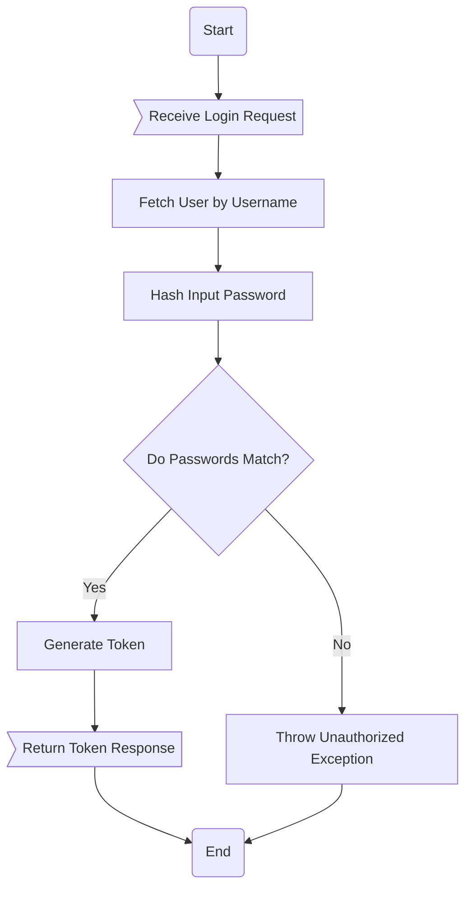
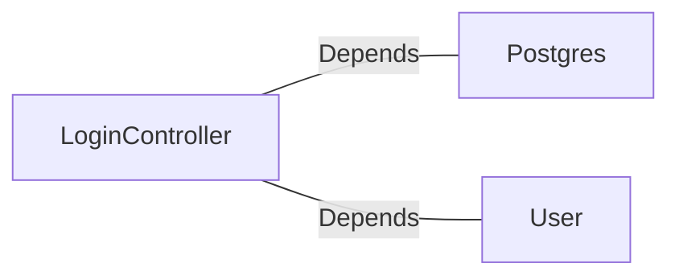

# LoginController.java: Login Authentication Controller

## Overview
The `LoginController` class is a RESTful controller responsible for handling user login requests. It validates user credentials against stored data and generates a token upon successful authentication. The controller also handles unauthorized access by throwing appropriate exceptions.

## Process Flow

## Insights
- The `@RestController` annotation marks this class as a Spring REST controller.
- The `@CrossOrigin` annotation allows cross-origin requests from any origin (`*`), which could pose a security risk.
- The `/login` endpoint accepts POST requests with JSON payloads and returns a JSON response.
- The `@Value` annotation is used to inject the application secret from the configuration file.
- The `LoginRequest` and `LoginResponse` classes are simple data transfer objects (DTOs) for handling request and response data.
- The `Unauthorized` exception is used to handle unauthorized access with an HTTP 401 status code.

## Dependencies

- `Postgres`: Used to hash the input password for comparison.
- `User`: Used to fetch user details by username and validate credentials.

### List of Identified External References
- `Postgres`: Provides the `md5` method to hash the input password. Nature: Depends.
- `User`: Provides the `fetch` method to retrieve user details by username. Nature: Depends.

## Vulnerabilities
1. **Cross-Origin Resource Sharing (CORS) Misconfiguration**:
   - The `@CrossOrigin(origins = "*")` annotation allows requests from any origin, which can lead to security risks such as Cross-Site Request Forgery (CSRF) attacks.
   - **Mitigation**: Restrict the origins to trusted domains.

2. **Hardcoded Secret Injection**:
   - The `@Value("${app.secret}")` annotation relies on a secret stored in the application configuration. If the configuration is not secured, it could lead to exposure of sensitive information.
   - **Mitigation**: Use environment variables or a secure secrets management system.

3. **Password Hashing**:
   - The use of `Postgres.md5` for password hashing is not secure by modern standards. MD5 is considered cryptographically weak and vulnerable to attacks.
   - **Mitigation**: Use a stronger hashing algorithm like bcrypt, Argon2, or PBKDF2.

4. **Error Handling**:
   - The application throws a generic `Unauthorized` exception for failed login attempts. This could potentially allow attackers to infer valid usernames based on response times or error messages.
   - **Mitigation**: Implement generic error messages and consistent response times for both valid and invalid login attempts.

5. **Lack of Rate Limiting**:
   - The code does not implement rate limiting, making it vulnerable to brute force attacks.
   - **Mitigation**: Implement rate limiting to restrict the number of login attempts from a single IP address.

6. **Token Generation**:
   - The `user.token(secret)` method is used to generate a token, but the implementation details are not provided. If the token generation is not secure, it could lead to token forgery.
   - **Mitigation**: Ensure the token generation uses a secure algorithm like JWT with proper signing and expiration.

7. **Serialization Risks**:
   - The `LoginRequest` and `LoginResponse` classes implement `Serializable`, which could lead to deserialization vulnerabilities if not handled properly.
   - **Mitigation**: Avoid using `Serializable` unless necessary and validate all serialized data.
