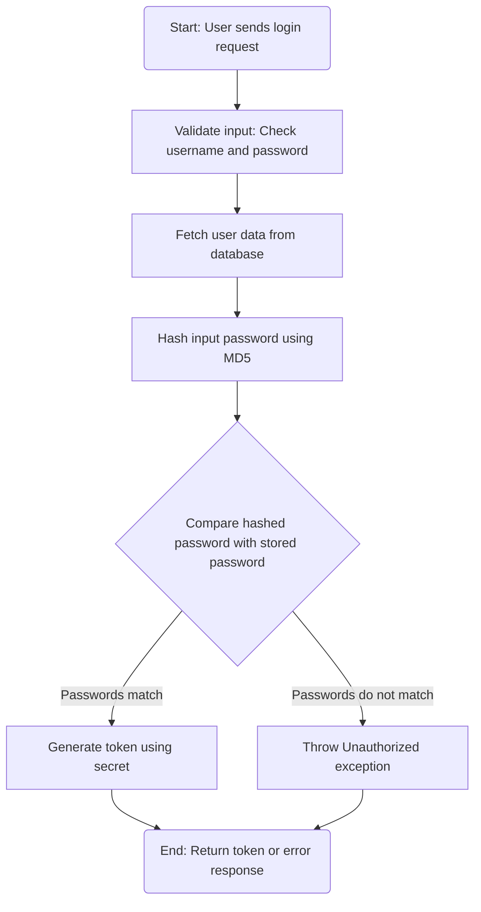
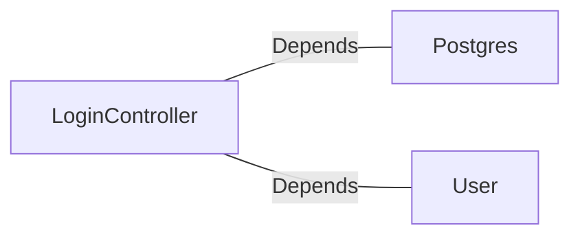

# LoginController.java: User Authentication Controller

## Overview
The `LoginController` class is responsible for handling user authentication requests. It validates user credentials against stored data and generates a token for successful logins. The controller uses Spring Boot annotations to define REST endpoints and manage HTTP responses.

## Process Flow

## Insights
- **Cross-Origin Resource Sharing (CORS):** The `@CrossOrigin` annotation allows requests from any origin, which may pose security risks if not properly configured.
- **Hardcoded MD5 Hashing:** The use of MD5 for password hashing is insecure due to vulnerabilities such as collision attacks. Consider using a stronger hashing algorithm like bcrypt or Argon2.
- **Exception Handling:** Unauthorized access is handled by throwing a custom `Unauthorized` exception with an HTTP 401 status code.
- **Token Generation:** Tokens are generated using a secret value, which is injected via the `@Value` annotation. Ensure the secret is securely stored and managed.
- **Serialization:** Both `LoginRequest` and `LoginResponse` classes implement `Serializable`, enabling easy data transfer.

## Vulnerabilities
1. **Weak Password Hashing:**
   - MD5 is used for hashing passwords, which is considered insecure. It is susceptible to brute-force and collision attacks.
   - Recommendation: Replace MD5 with a modern hashing algorithm like bcrypt or Argon2.

2. **CORS Misconfiguration:**
   - The `@CrossOrigin(origins = "*")` annotation allows requests from any origin, which can lead to security risks such as Cross-Site Request Forgery (CSRF).
   - Recommendation: Restrict allowed origins to trusted domains.

3. **Potential Secret Exposure:**
   - The `secret` value is injected from application properties. If not properly secured, it could be exposed or misused.
   - Recommendation: Use environment variables or a secure vault for managing secrets.

4. **Error Disclosure:**
   - Throwing an `Unauthorized` exception with a generic message ("Access Denied") may not provide sufficient information for debugging but could be exploited for enumeration attacks.
   - Recommendation: Log detailed errors internally while providing generic error messages to the client.

## Dependencies

- `Postgres`: Used for hashing the input password using MD5.
- `User`: Represents the user entity and provides methods to fetch user data and generate tokens.

## Data Manipulation (SQL)
- **User.fetch(username):** Likely involves a SQL SELECT operation to retrieve user data based on the provided username. Ensure proper sanitization to prevent SQL injection.

### User Entity Attributes
| Attribute       | Type   | Description                          |
|------------------|--------|--------------------------------------|
| `username`      | String | The username of the user.            |
| `hashedPassword`| String | The hashed password stored in the database. |
| `token(secret)` | String | Method to generate a token using the secret. |
