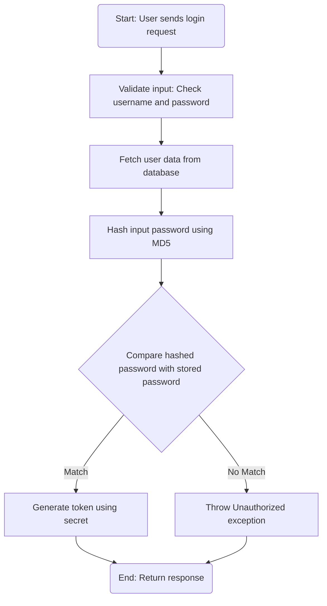
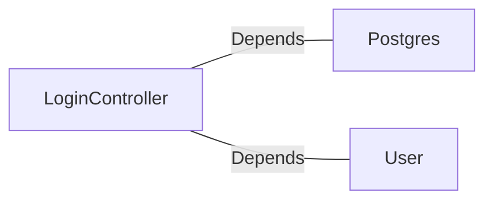

# LoginController.java: Login Authentication Controller

## Overview
The `LoginController` class is a REST API controller responsible for handling user login requests. It validates user credentials against stored data and generates a token for successful authentication. The controller uses Spring Boot annotations and integrates with external dependencies for user data fetching and password hashing.

## Process Flow

## Insights
- **Cross-Origin Resource Sharing (CORS):** The `@CrossOrigin` annotation allows requests from any origin, which may pose security risks if not properly configured.
- **Password Hashing:** The code uses MD5 for password hashing, which is considered insecure and vulnerable to collision attacks. A stronger hashing algorithm like bcrypt or Argon2 should be used.
- **Hardcoded Secret:** The `secret` is injected via application properties, but its security depends on proper configuration and storage.
- **Error Handling:** Unauthorized access is handled by throwing a custom `Unauthorized` exception with HTTP status 401.
- **Serialization:** Both `LoginRequest` and `LoginResponse` implement `Serializable`, which is useful for object serialization but unnecessary for this context unless explicitly required.

## Dependencies

- `Postgres`: Used for hashing the input password using MD5.
- `User`: Fetches user data from the database, including the hashed password and token generation.

### List of Identified External References
- `Postgres`: Provides the `md5` method for hashing passwords. Nature: Depends.
- `User`: Provides the `fetch` method to retrieve user data and the `token` method to generate authentication tokens. Nature: Depends.

## Vulnerabilities
1. **Insecure Password Hashing Algorithm:**
   - MD5 is used for hashing passwords, which is outdated and vulnerable to brute-force and collision attacks.
   - Recommendation: Replace MD5 with a secure hashing algorithm like bcrypt or Argon2.

2. **CORS Misconfiguration:**
   - The `@CrossOrigin(origins = "*")` annotation allows requests from any origin, which can expose the application to Cross-Site Request Forgery (CSRF) attacks.
   - Recommendation: Restrict origins to trusted domains.

3. **Potential Secret Exposure:**
   - The `secret` is injected via application properties. If not securely stored or managed, it could be exposed and compromise token generation.
   - Recommendation: Use a secure vault or environment variables to store sensitive secrets.

4. **Lack of Rate Limiting:**
   - The login endpoint does not implement rate limiting, making it susceptible to brute-force attacks.
   - Recommendation: Implement rate limiting to restrict the number of login attempts.

5. **Error Message Disclosure:**
   - The `Unauthorized` exception message may provide clues to attackers about the authentication process.
   - Recommendation: Use generic error messages to avoid revealing sensitive information.

## Data Manipulation (SQL)
- **User Data Fetching:** The `User.fetch` method retrieves user data from the database, including the hashed password and token information.
