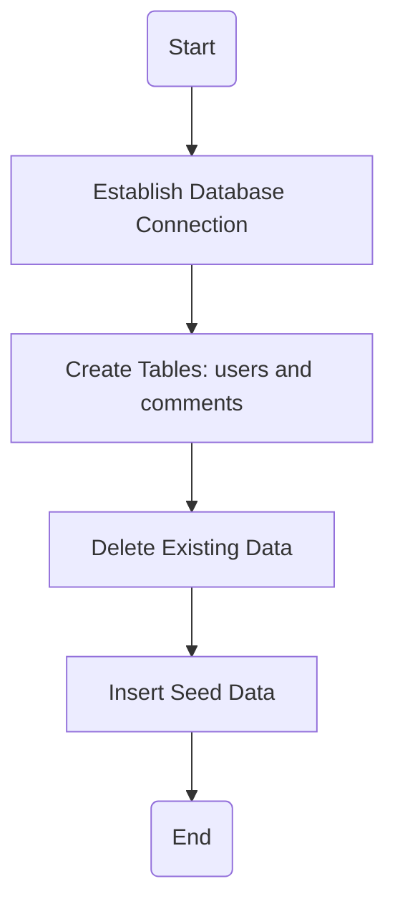
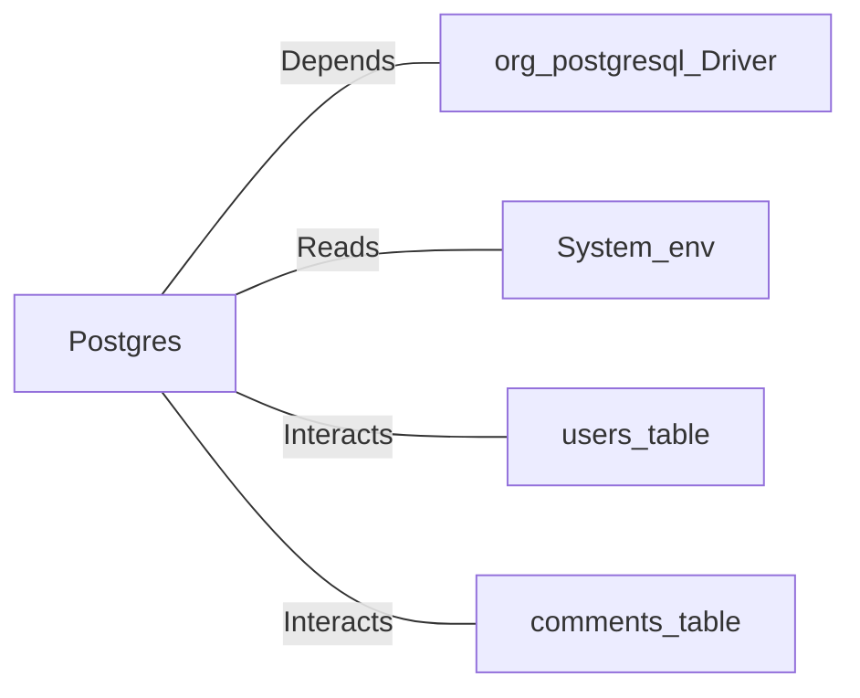

# Postgres.java: Database Setup and Interaction Utility

## Overview
This Java program provides utility methods for setting up and interacting with a PostgreSQL database. It includes functionality for establishing database connections, creating schemas, inserting seed data, and hashing passwords using MD5. The program is designed to initialize a database with predefined tables and seed data for users and comments.

## Process Flow

## Insights
- **Database Connection**: The `connection()` method dynamically constructs the database connection string using environment variables (`PGHOST`, `PGDATABASE`, `PGUSER`, `PGPASSWORD`).
- **Schema Creation**: The `setup()` method creates two tables (`users` and `comments`) if they do not already exist.
- **Data Cleanup**: Existing data in the `users` and `comments` tables is deleted during setup.
- **Seed Data**: Predefined users and comments are inserted into the database for testing or initial setup.
- **Password Hashing**: Passwords are hashed using MD5 before being stored in the database.
- **Error Handling**: Exceptions are caught and printed, but the program exits on critical errors, such as connection failures.
- **Security Concerns**: MD5 is used for password hashing, which is considered insecure for modern applications.

## Dependencies

- `org.postgresql.Driver`: Used for establishing a connection to the PostgreSQL database.
- `System.getenv`: Reads environment variables for database connection details.
- `users_table`: Table for storing user information, including hashed passwords.
- `comments_table`: Table for storing user comments.

## Data Manipulation (SQL)
### Table Structures
#### `users` Table
| Attribute    | Type          | Description                                      |
|--------------|---------------|--------------------------------------------------|
| `user_id`    | VARCHAR(36)   | Primary key, unique identifier for the user.     |
| `username`   | VARCHAR(50)   | Unique username for the user.                    |
| `password`   | VARCHAR(50)   | MD5 hashed password.                             |
| `created_on` | TIMESTAMP     | Timestamp of user creation.                      |
| `last_login` | TIMESTAMP     | Timestamp of the last login.                     |

#### `comments` Table
| Attribute    | Type          | Description                                      |
|--------------|---------------|--------------------------------------------------|
| `id`         | VARCHAR(36)   | Primary key, unique identifier for the comment.  |
| `username`   | VARCHAR(36)   | Username of the commenter.                       |
| `body`       | VARCHAR(500)  | Content of the comment.                          |
| `created_on` | TIMESTAMP     | Timestamp of comment creation.                   |

### SQL Operations
- `CREATE TABLE`: Creates the `users` and `comments` tables if they do not exist.
- `DELETE`: Removes all existing data from the `users` and `comments` tables.
- `INSERT`: Adds seed data to the `users` and `comments` tables.

## Vulnerabilities
1. **Insecure Password Hashing**:
   - MD5 is used for hashing passwords, which is vulnerable to collision attacks and brute force. Modern algorithms like bcrypt or Argon2 should be used instead.

2. **Hardcoded Seed Data**:
   - The program inserts hardcoded usernames and passwords, which could lead to security risks if used in production.

3. **Environment Variable Exposure**:
   - Database credentials are retrieved from environment variables but are not encrypted or obfuscated.

4. **Error Handling**:
   - Exceptions are printed to the console, potentially exposing sensitive information. Proper logging mechanisms should be implemented.

5. **SQL Injection Risk**:
   - While `PreparedStatement` is used for inserting data, the program does not sanitize inputs for other potential SQL operations.
