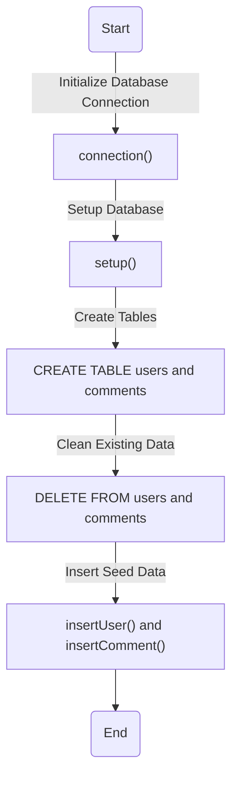
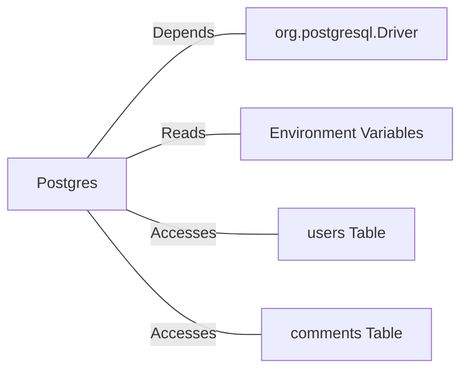

# Postgres.java: Database Setup and Interaction Utility

## Overview
This Java program provides utility methods for setting up and interacting with a PostgreSQL database. It includes functionality for establishing database connections, creating schemas, inserting seed data, and hashing passwords using MD5. The program is designed to initialize a database with predefined tables and seed data for users and comments.

## Process Flow

## Insights
- **Database Connection**: The `connection()` method dynamically constructs the database connection string using environment variables (`PGHOST`, `PGDATABASE`, `PGUSER`, `PGPASSWORD`).
- **Schema Creation**: The `setup()` method ensures the required tables (`users` and `comments`) exist and cleans up any existing data.
- **Password Hashing**: Passwords are hashed using MD5 before being stored in the database, which is considered insecure for modern applications.
- **Seed Data**: Predefined users and comments are inserted into the database for testing or initial setup.
- **Error Handling**: Exceptions are caught and printed, but the program exits abruptly (`System.exit(1)`) on errors, which may not be ideal for production environments.

## Dependencies

- `org.postgresql.Driver`: Required for connecting to the PostgreSQL database.
- `Environment Variables`: Used to configure database connection parameters (`PGHOST`, `PGDATABASE`, `PGUSER`, `PGPASSWORD`).
- `users`: Table for storing user information, including hashed passwords.
- `comments`: Table for storing user comments.

## Data Manipulation (SQL)
### Table Structures
#### `users` Table
| Attribute    | Type          | Description                                      |
|--------------|---------------|--------------------------------------------------|
| `user_id`    | VARCHAR(36)   | Primary key, unique identifier for the user.     |
| `username`   | VARCHAR(50)   | Unique username for the user.                    |
| `password`   | VARCHAR(50)   | MD5-hashed password.                             |
| `created_on` | TIMESTAMP     | Timestamp when the user was created.             |
| `last_login` | TIMESTAMP     | Timestamp of the user's last login.              |

#### `comments` Table
| Attribute    | Type          | Description                                      |
|--------------|---------------|--------------------------------------------------|
| `id`         | VARCHAR(36)   | Primary key, unique identifier for the comment.  |
| `username`   | VARCHAR(36)   | Username of the commenter.                       |
| `body`       | VARCHAR(500)  | Content of the comment.                          |
| `created_on` | TIMESTAMP     | Timestamp when the comment was created.          |

### SQL Operations
- **CREATE TABLE**: Creates `users` and `comments` tables if they do not exist.
- **DELETE FROM**: Cleans up existing data in `users` and `comments` tables.
- **INSERT INTO**: Inserts seed data into `users` and `comments` tables.

## Vulnerabilities
1. **MD5 for Password Hashing**:
   - MD5 is considered cryptographically insecure and vulnerable to collision attacks. Modern applications should use stronger hashing algorithms like bcrypt, Argon2, or PBKDF2.

2. **Hardcoded Seed Data**:
   - The program inserts hardcoded usernames and passwords, which could lead to security risks if used in production.

3. **Error Handling**:
   - The use of `System.exit(1)` for error handling is abrupt and may not allow proper cleanup or logging in production environments.

4. **Environment Variable Exposure**:
   - Sensitive database credentials are fetched from environment variables but are not encrypted or masked, which could lead to exposure in certain scenarios.

5. **SQL Injection Risk**:
   - While `PreparedStatement` is used for inserting data, the program does not sanitize or validate inputs, which could lead to SQL injection vulnerabilities if extended improperly.
