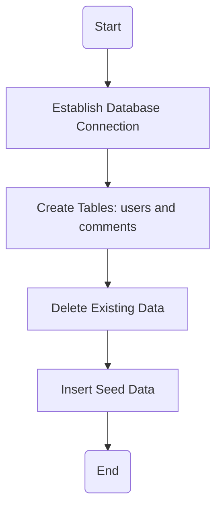
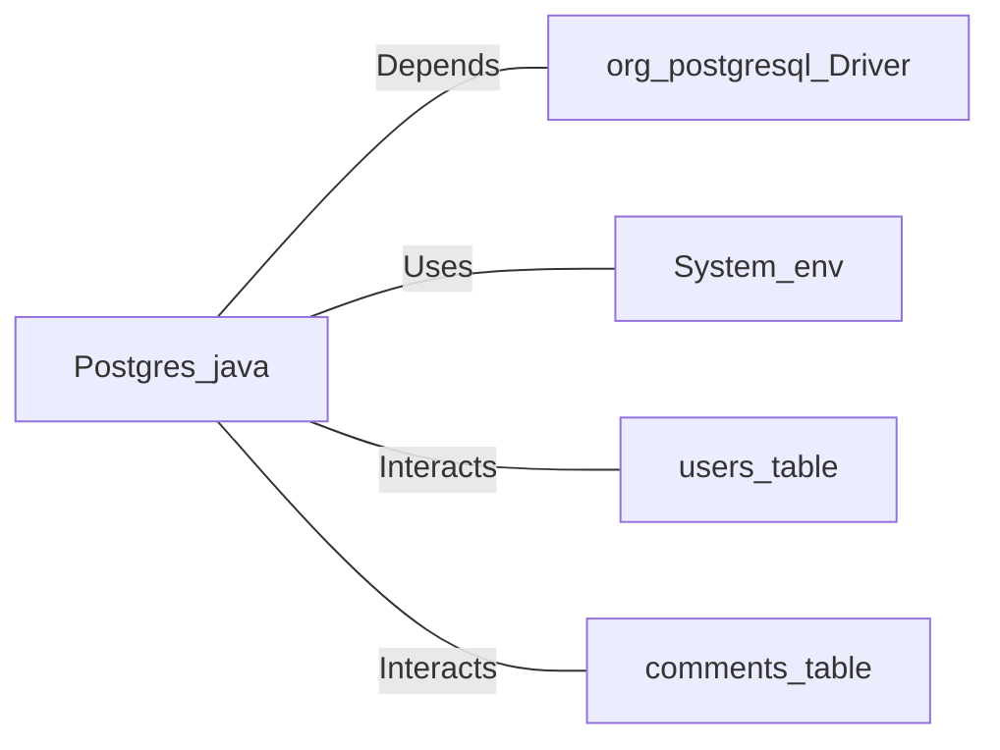

# Postgres.java: Database Setup and Interaction Utility

## Overview
This Java program provides utility methods for setting up and interacting with a PostgreSQL database. It includes functionality for establishing database connections, creating schemas, inserting seed data, and hashing passwords using MD5. The program is designed to initialize a database with predefined tables and seed data for users and comments.

## Process Flow

## Insights
- **Database Connection**: The program dynamically constructs the database connection string using environment variables (`PGHOST`, `PGDATABASE`, `PGUSER`, `PGPASSWORD`).
- **Schema Creation**: Two tables (`users` and `comments`) are created if they do not already exist.
- **Seed Data**: Predefined users and comments are inserted into the database for testing or initialization purposes.
- **Password Hashing**: User passwords are hashed using MD5 before being stored in the database.
- **Error Handling**: Exceptions are caught and printed, but the program exits on critical errors, such as connection failures.
- **UUID Usage**: Unique identifiers for users and comments are generated using `UUID.randomUUID()`.

## Vulnerabilities
1. **MD5 for Password Hashing**:
   - MD5 is considered cryptographically weak and vulnerable to collision attacks. It is not recommended for password hashing. Use a stronger algorithm like bcrypt or Argon2.
   
2. **Hardcoded Seed Data**:
   - The program inserts hardcoded usernames and passwords, which could lead to security risks if used in production environments.

3. **Environment Variable Exposure**:
   - Sensitive database credentials are retrieved from environment variables. Ensure these variables are securely managed and not exposed.

4. **SQL Injection Risk**:
   - While `PreparedStatement` is used to prevent SQL injection, the program does not sanitize or validate input data, which could lead to other vulnerabilities.

5. **Error Handling**:
   - The program prints stack traces directly, which could expose sensitive information in a production environment.

## Dependencies

- `org.postgresql.Driver`: Required for connecting to the PostgreSQL database.
- `System.env`: Used to retrieve environment variables for database connection.
- `users_table`: Table for storing user information, including hashed passwords.
- `comments_table`: Table for storing user comments.

## Data Manipulation (SQL)
### Table Structures
#### `users`
| Attribute    | Type          | Description                              |
|--------------|---------------|------------------------------------------|
| `user_id`    | VARCHAR(36)   | Primary key, unique identifier for users |
| `username`   | VARCHAR(50)   | Unique username                         |
| `password`   | VARCHAR(50)   | MD5 hashed password                     |
| `created_on` | TIMESTAMP     | Timestamp of user creation              |
| `last_login` | TIMESTAMP     | Timestamp of last login                 |

#### `comments`
| Attribute    | Type          | Description                              |
|--------------|---------------|------------------------------------------|
| `id`         | VARCHAR(36)   | Primary key, unique identifier for comments |
| `username`   | VARCHAR(36)   | Username of the commenter               |
| `body`       | VARCHAR(500)  | Comment text                            |
| `created_on` | TIMESTAMP     | Timestamp of comment creation           |

### SQL Operations
- `users`: 
  - **INSERT**: Adds new users with hashed passwords and timestamps.
  - **DELETE**: Removes all existing user data during setup.
- `comments`: 
  - **INSERT**: Adds new comments with timestamps.
  - **DELETE**: Removes all existing comment data during setup.
