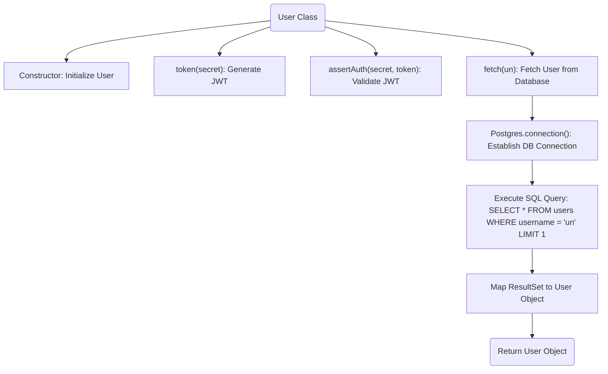
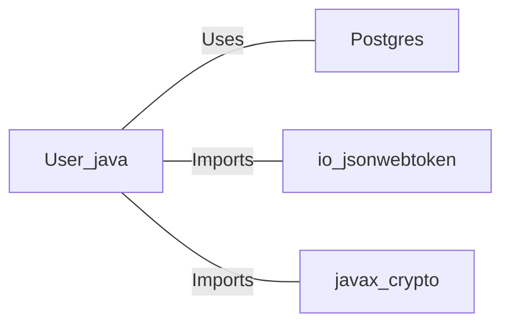

# User.java: User Management and Authentication

## Overview
This class provides functionalities for user management and authentication. It includes methods for generating JSON Web Tokens (JWT), validating tokens, and fetching user details from a database. The class also demonstrates interaction with a PostgreSQL database and the use of the `io.jsonwebtoken` library for token management.

## Process Flow

## Insights
- **JWT Generation**: The `token` method generates a JWT for the user using a secret key.
- **JWT Validation**: The `assertAuth` method validates a given JWT using the same secret key.
- **Database Interaction**: The `fetch` method retrieves user details from a PostgreSQL database based on the username.
- **Potential SQL Injection**: The `fetch` method constructs SQL queries using string concatenation, making it vulnerable to SQL injection attacks.
- **Error Handling**: Exceptions are caught and printed, but the program continues execution, which may lead to unintended behavior.
- **Static Method Usage**: The `fetch` and `assertAuth` methods are static, allowing them to be called without an instance of the `User` class.

## Dependencies

- `Postgres`: Provides the `connection()` method to establish a connection to the PostgreSQL database.
- `io.jsonwebtoken`: Used for JWT generation and validation.
- `javax.crypto`: Used for cryptographic operations, specifically for generating the secret key.

## Vulnerabilities
1. **SQL Injection**:
   - The `fetch` method constructs SQL queries using string concatenation, which is vulnerable to SQL injection.
   - **Mitigation**: Use prepared statements or parameterized queries to prevent SQL injection.

2. **Hardcoded Secret Key**:
   - The `token` and `assertAuth` methods rely on a secret key passed as a string. If the secret is not securely managed, it could be exposed.
   - **Mitigation**: Use a secure key management system to store and retrieve the secret key.

3. **Weak Error Handling**:
   - Exceptions are caught and printed, but the program continues execution. This could lead to security issues or undefined behavior.
   - **Mitigation**: Implement proper error handling and logging mechanisms.

4. **Token Signing Algorithm**:
   - The `token` method uses `HMAC-SHA` for signing. While secure, ensure the secret key is sufficiently strong and not reused across different applications.

5. **Database Connection Management**:
   - The database connection is not properly closed in case of an exception, which could lead to resource leaks.
   - **Mitigation**: Use a `try-with-resources` block or explicitly close the connection in a `finally` block.

## Data Manipulation (SQL)
### Table: `users`
| Attribute   | Data Type | Description                          |
|-------------|-----------|--------------------------------------|
| `user_id`   | String    | Unique identifier for the user.      |
| `username`  | String    | Username of the user.                |
| `password`  | String    | Hashed password of the user.         |

### SQL Command
- **Query**: `SELECT * FROM users WHERE username = 'un' LIMIT 1`
  - **Operation**: SELECT
  - **Description**: Fetches the first user record matching the given username.
