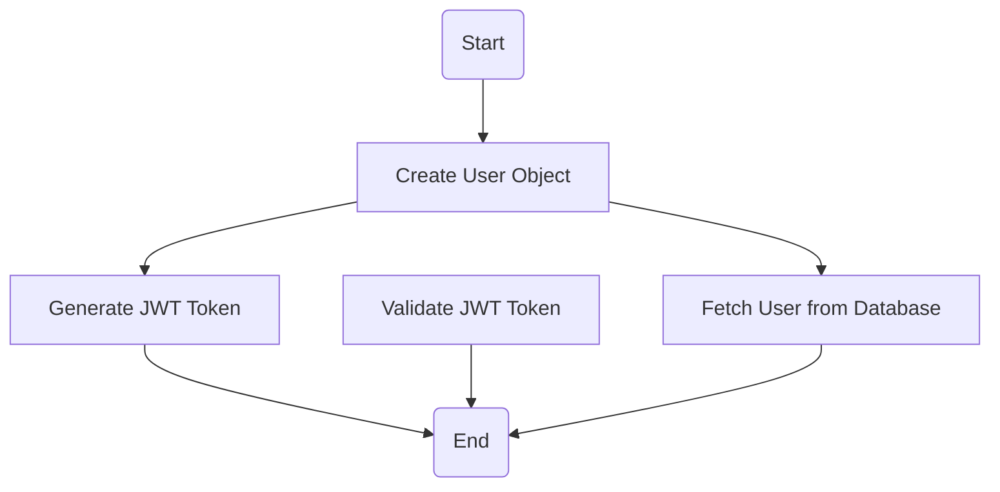
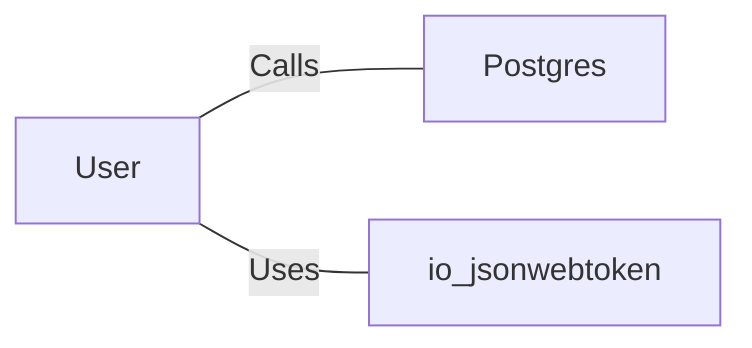

# User.java: User Management and Authentication

## Overview
The `User` class is responsible for managing user-related data and operations, including token generation, authentication, and fetching user details from a database. It provides methods for creating JSON Web Tokens (JWTs), validating tokens, and retrieving user information from a PostgreSQL database.

## Process Flow

## Insights
- **Token Generation**: The `token` method generates a JWT using the user's username and a secret key. It uses the HMAC SHA algorithm for signing.
- **Token Validation**: The `assertAuth` method validates a JWT token using the provided secret key. If validation fails, it throws an `Unauthorized` exception.
- **Database Interaction**: The `fetch` method retrieves user details from a PostgreSQL database based on the username. It constructs a SQL query dynamically.
- **Potential Vulnerabilities**:
  - **SQL Injection**: The `fetch` method constructs SQL queries using string concatenation, making it vulnerable to SQL injection attacks.
  - **Hardcoded Secret Key**: The `token` and `assertAuth` methods rely on a secret key passed as a string, which could be mishandled or exposed.
  - **Improper Exception Handling**: The `assertAuth` method prints stack traces, which could expose sensitive information in production environments.

## Dependencies

- `Postgres`: Provides a connection to the PostgreSQL database. Used in the `fetch` method to retrieve user data.
- `io.jsonwebtoken`: A library for creating and parsing JWTs. Used in the `token` and `assertAuth` methods.

## Data Manipulation (SQL)
### Table: `users`
| Attribute   | Type     | Description                          |
|-------------|----------|--------------------------------------|
| `user_id`   | String   | Unique identifier for the user.      |
| `username`  | String   | Username of the user.                |
| `password`  | String   | Hashed password of the user.         |

### SQL Command
- **Query**: `SELECT * FROM users WHERE username = '<username>' LIMIT 1`
  - **Operation**: SELECT
  - **Description**: Retrieves user details based on the provided username.

## Vulnerabilities
1. **SQL Injection**:
   - The `fetch` method constructs SQL queries using string concatenation, which is vulnerable to SQL injection attacks. Example: If `un` contains malicious SQL code, it could compromise the database.
   - **Mitigation**: Use prepared statements or parameterized queries to prevent SQL injection.

2. **Hardcoded Secret Key**:
   - The `token` and `assertAuth` methods rely on a secret key passed as a string. If mishandled, this could lead to security breaches.
   - **Mitigation**: Store secrets securely using environment variables or a secrets management tool.

3. **Improper Exception Handling**:
   - The `assertAuth` method prints stack traces, which could expose sensitive information in production environments.
   - **Mitigation**: Log errors securely and avoid exposing stack traces to end-users.

4. **Unclosed Statement**:
   - The `fetch` method does not explicitly close the `Statement` object, which could lead to resource leaks.
   - **Mitigation**: Use a `try-with-resources` block to ensure proper resource management.
