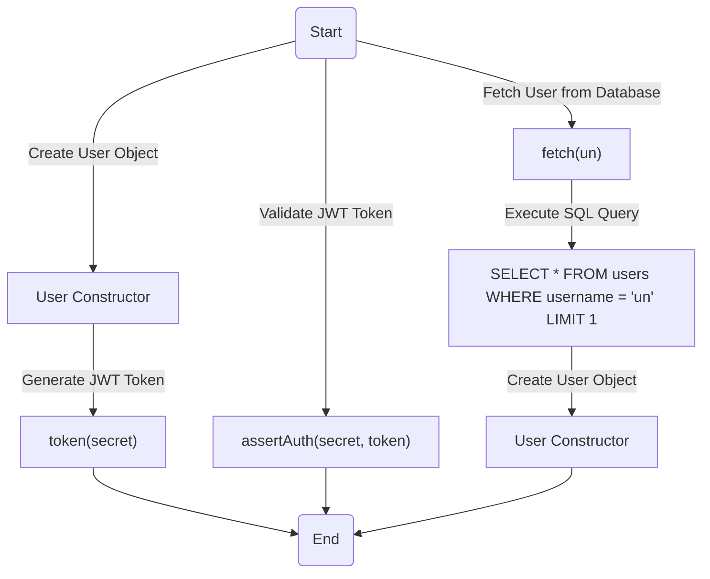
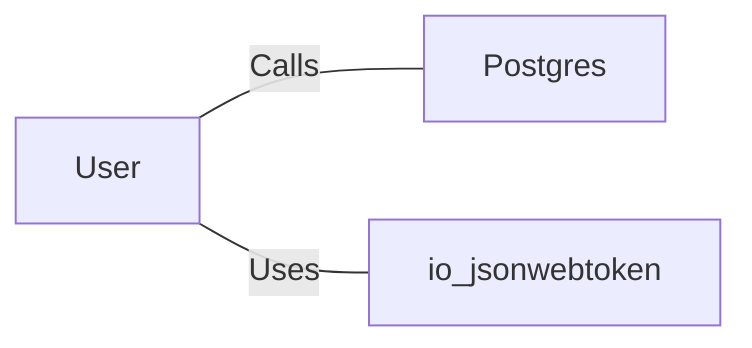

# User.java: User Management and Authentication

## Overview
The `User` class is responsible for managing user-related operations, including token generation, authentication, and fetching user details from a database. It provides methods for creating JSON Web Tokens (JWTs), validating tokens, and retrieving user information from a PostgreSQL database.

## Process Flow

## Insights
- **Token Generation**: The `token` method generates a JWT using the HMAC SHA key derived from the provided secret. The token includes the username as the subject.
- **Token Validation**: The `assertAuth` method validates a JWT using the provided secret key. If validation fails, an `Unauthorized` exception is thrown.
- **SQL Injection Vulnerability**: The `fetch` method constructs SQL queries using string concatenation, making it vulnerable to SQL injection attacks. This should be mitigated by using prepared statements.
- **Database Connection Handling**: The `fetch` method does not properly close the `Statement` object, which could lead to resource leaks.
- **Error Handling**: Exceptions are caught and printed, but the program continues execution, which may lead to undefined behavior or security risks.

## Dependencies

- `Postgres`: Provides the database connection used in the `fetch` method.
- `io.jsonwebtoken`: Used for creating and parsing JWTs.

## Vulnerabilities
1. **SQL Injection**:
   - The `fetch` method constructs SQL queries using string concatenation, allowing attackers to inject malicious SQL code.
   - Example: If `un` is set to `"' OR '1'='1"`, the query becomes `SELECT * FROM users WHERE username = '' OR '1'='1' LIMIT 1`, potentially exposing all user data.

2. **Hardcoded Secret Key**:
   - The `token` and `assertAuth` methods rely on a secret key passed as a parameter. If the secret is not securely managed, it could lead to token forgery.

3. **Resource Leak**:
   - The `Statement` object in the `fetch` method is not closed, which may lead to resource exhaustion over time.

4. **Weak Error Handling**:
   - Exceptions are caught and printed but not properly handled, which could expose sensitive information or lead to undefined behavior.

## Data Manipulation (SQL)
### Table: `users`
| Attribute   | Type         | Description                          |
|-------------|--------------|--------------------------------------|
| `user_id`   | VARCHAR      | Unique identifier for the user.      |
| `username`  | VARCHAR      | Username of the user.                |
| `password`  | VARCHAR      | Hashed password of the user.         |

### SQL Command
- **SELECT**: Retrieves user details based on the username.
  - Query: `SELECT * FROM users WHERE username = 'un' LIMIT 1`
