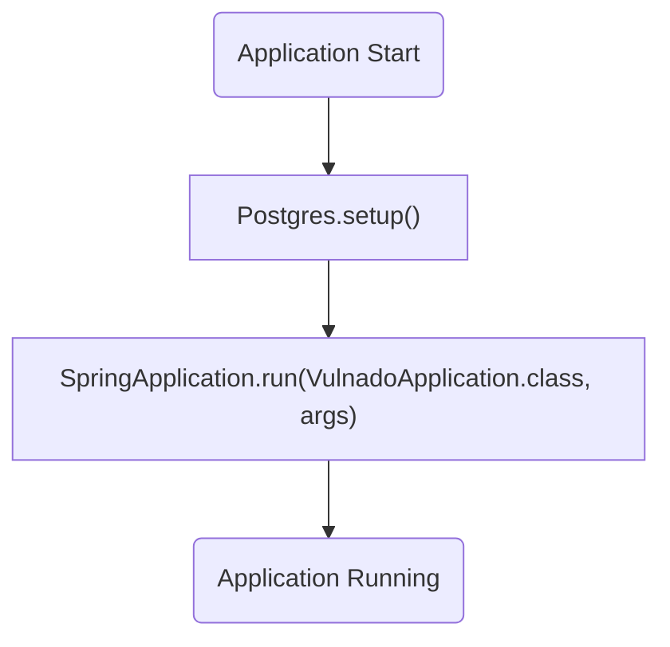
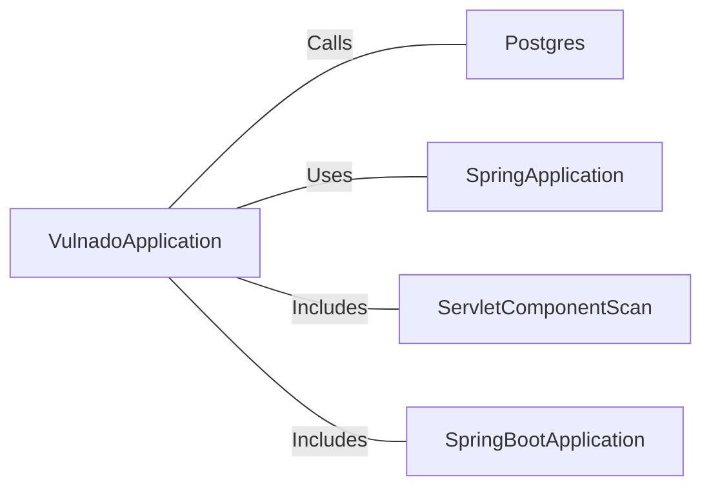

# VulnadoApplication.java: Spring Boot Application Entry Point

## Overview
The `VulnadoApplication` class serves as the entry point for a Spring Boot application. It initializes the application context and sets up necessary configurations, including database setup through the `Postgres.setup()` method. The class is annotated with `@SpringBootApplication` and `@ServletComponentScan`, enabling Spring Boot's auto-configuration and scanning for servlet components.

## Process Flow

## Insights
- The `@SpringBootApplication` annotation combines three annotations: `@Configuration`, `@EnableAutoConfiguration`, and `@ComponentScan`, simplifying Spring Boot application setup.
- The `@ServletComponentScan` annotation enables scanning for servlet components, such as filters and listeners, within the application.
- The `Postgres.setup()` method is called before the application starts, indicating that database setup is a critical step in the initialization process.
- The `SpringApplication.run()` method is responsible for bootstrapping the application and starting the embedded server.

## Dependencies

- `Postgres`: The `setup()` method is called to initialize the database. The exact implementation of this method is not provided in the code snippet.
- `SpringApplication`: Used to bootstrap and launch the Spring Boot application.
- `ServletComponentScan`: Enables scanning for servlet components.
- `SpringBootApplication`: Provides auto-configuration and component scanning for the application.

## Vulnerabilities
- **Potential Database Misconfiguration**: The `Postgres.setup()` method is called without any error handling or validation in the provided code snippet. If the database setup fails, it could lead to application startup issues.
- **Implicit Dependency on Postgres**: The application assumes the presence of a `Postgres` class with a `setup()` method. If this class is missing or improperly implemented, the application will fail to start.
- **Lack of Security Measures**: No security configurations or validations are evident in the provided code snippet, which could expose the application to vulnerabilities if not addressed elsewhere in the codebase.
