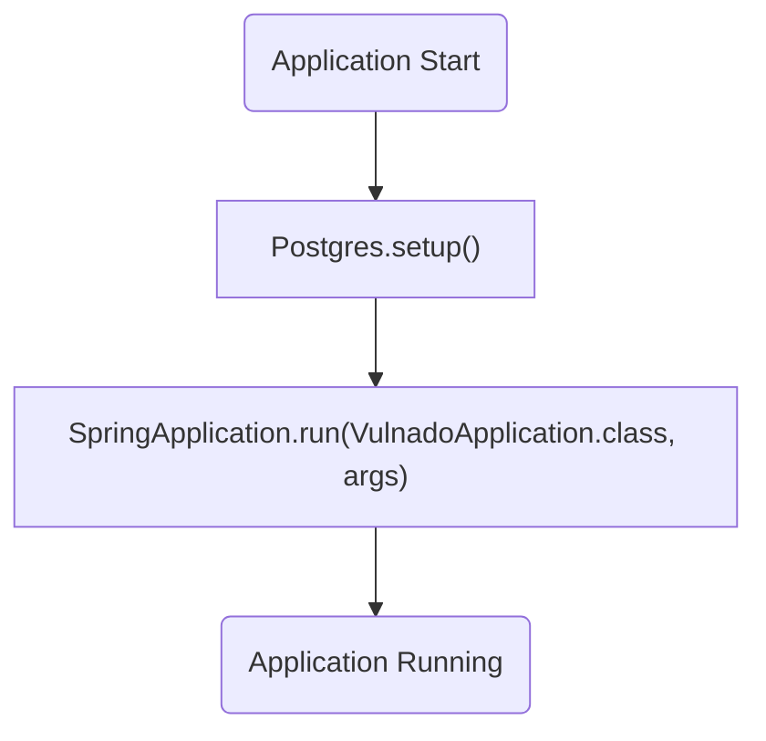
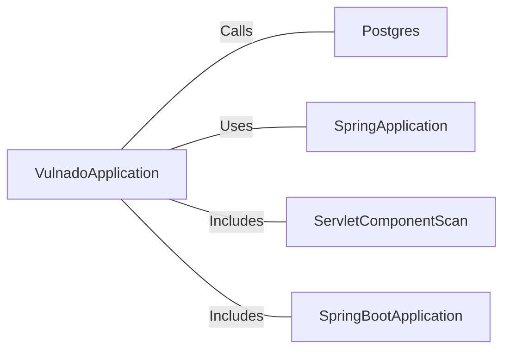

# VulnadoApplication.java: Spring Boot Application Entry Point

## Overview
The `VulnadoApplication` class serves as the entry point for a Spring Boot application. It initializes the application context and sets up necessary configurations, including database setup through the `Postgres.setup()` method. The class is annotated with `@SpringBootApplication` and `@ServletComponentScan`, enabling Spring Boot's auto-configuration and scanning for servlet components.

## Process Flow

## Insights
- The `@SpringBootApplication` annotation combines three annotations: `@Configuration`, `@EnableAutoConfiguration`, and `@ComponentScan`, simplifying Spring Boot application setup.
- The `@ServletComponentScan` annotation enables scanning for servlet components, such as filters and listeners, within the application.
- The `Postgres.setup()` method is called before the application context is initialized, indicating that it likely performs database-related setup tasks.
- The `SpringApplication.run()` method starts the Spring Boot application, initializing the application context and starting the embedded server.

## Dependencies

- `Postgres`: Called via `Postgres.setup()` to perform database setup tasks.
- `SpringApplication`: Used to bootstrap and launch the Spring Boot application.
- `ServletComponentScan`: Enables scanning for servlet components.
- `SpringBootApplication`: Provides auto-configuration and component scanning for the application.

## Vulnerabilities
- **Potential Database Misconfiguration**: The `Postgres.setup()` method is invoked, but its implementation is not provided. If this method does not properly handle database credentials or configurations, it could lead to security vulnerabilities such as SQL injection or unauthorized access.
- **Servlet Component Exposure**: The use of `@ServletComponentScan` may inadvertently expose servlet components if not properly secured, potentially leading to vulnerabilities like unauthorized access or data leakage.
- **Hardcoded Configuration Risks**: If `Postgres.setup()` relies on hardcoded values for database setup, it could expose sensitive information or make the application less flexible and secure.
