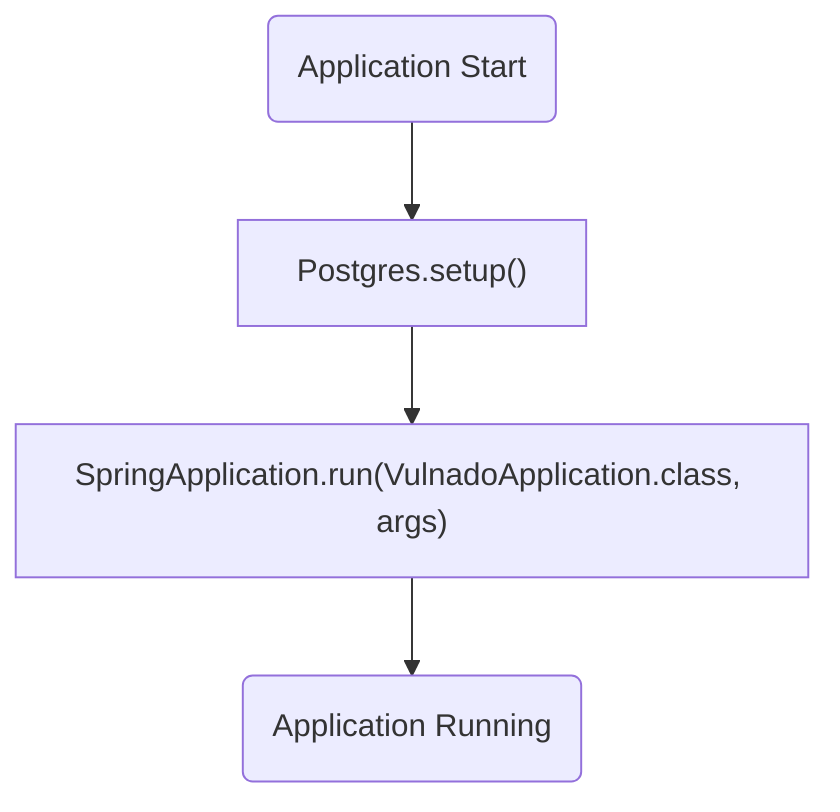
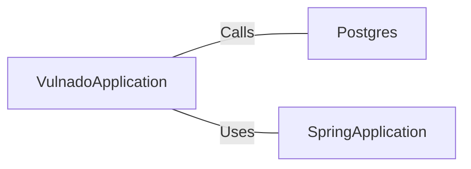

# VulnadoApplication.java: Spring Boot Application Entry Point

## Overview
The `VulnadoApplication` class serves as the entry point for a Spring Boot application. It initializes the application context and sets up necessary configurations, including database setup through the `Postgres.setup()` method.

## Process Flow

## Insights
- The class is annotated with `@SpringBootApplication`, which is a convenience annotation that combines `@Configuration`, `@EnableAutoConfiguration`, and `@ComponentScan`.
- The `@ServletComponentScan` annotation enables scanning for servlet components such as filters and listeners.
- The `Postgres.setup()` method is called before the Spring Boot application starts, indicating that some database initialization or configuration is performed.
- The `SpringApplication.run()` method is used to bootstrap the application.

## Dependencies

- `Postgres`: The `setup()` method is called to perform database-related initialization.
- `SpringApplication`: Used to bootstrap and launch the Spring Boot application.

## Vulnerabilities
- **Potential Database Misconfiguration**: The `Postgres.setup()` method is called without any visible error handling or validation. If the database setup fails, it could lead to application startup issues.
- **Implicit Dependency on Postgres**: The application assumes the presence of a `Postgres` class and its `setup()` method. If this dependency is not properly implemented or configured, the application will fail to start.
- **No Security Measures for Servlet Components**: While `@ServletComponentScan` enables scanning for servlet components, there is no indication of security measures or validation for these components, which could lead to vulnerabilities if malicious servlets are introduced.
